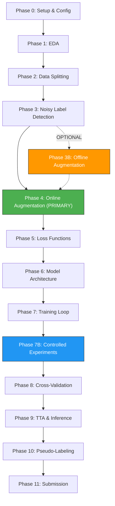

# Phase 0 — Project Overview, Configuration & Environment Setup

## 0.1 Competition Context

| Item | Detail |
|------|--------|
| **Competition** | OctWave 3.0 — Tom & Jerry Image Classification |
| **Task** | 4-class classification of cartoon frames |
| **Classes** | `0` = Neither, `1` = Tom only, `2` = Jerry only, `3` = Both |
| **Metric** | **Macro F1-Score** |
| **Train samples** | 2,680 (noisy labels, severe imbalance) |
| **Test samples** | 2,798 (clean labels) |
| **Total images** | 5,478 (shared `images/images/` folder) |
| **Submission** | CSV: `filename, appearance` |
| **Daily limit** | 20 submissions/day, **only 2 count** for final LB |

### Class Distribution (Train)

| Class | Label | Count | Percentage |
|-------|-------|-------|------------|
| 0 | Neither | 368 | 13.7% |
| 1 | Tom only | 1,252 | 46.7% |
| 2 | Jerry only | 841 | 31.4% |
| 3 | Both | 219 | 8.2% |

> [!WARNING]
> Class 3 (Both) has only 219 samples — **17.5% of the majority class**. Class 0 is also minority.
> The model will struggle most on classes 0 and 3. Macro F1 means each class weighs equally.

---

## 0.2 Project Directory Structure

```
Octwave_image_classification-/
├── Data/
│   └── oct-wave-3-0-kaggle-challenge-02/
│       ├── images/
│       │   └── images/          # All 5,478 .jpg files
│       ├── train.csv            # filename, appearance (2,680 rows)
│       ├── test.csv             # filename (2,798 rows)
│       └── sample_submission.csv
├── MD/                          # Competition docs
├── implementation/              # ← THIS: Phase-wise plans
└── src/                         # ← TO CREATE: All pipeline code
    ├── config.py                # Central config (YAML loader + defaults)
    ├── config.yaml              # Tunable hyperparameters
    ├── eda.py                   # Phase 1: Exploratory data analysis
    ├── data.py                  # Phase 2: Dataset, splits, loaders
    ├── noise.py                 # Phase 3: Noisy label detection
    ├── offline_augment.py       # Phase 3B: Offline augmentation + resolution (OPTIONAL)
    ├── augment.py               # Phase 4: Online augmentation pipeline (PRIMARY)
    ├── losses.py                # Phase 5: Loss functions
    ├── model.py                 # Phase 6: Model architecture
    ├── train.py                 # Phase 7: Training loop
    ├── experiment_runner.py     # Phase 7B: Controlled experiment framework ← NEW
    ├── crossval.py              # Phase 8: Cross-validation + ensembling
    ├── infer.py                 # Phase 9: Inference + TTA
    ├── pseudo.py                # Phase 10: Pseudo-labeling
    ├── submit.py                # Phase 11: Submission generation
    ├── utils.py                 # Shared utilities (metrics, logging, seeding)
    └── outputs/                 # Checkpoints, logs, submissions
        ├── checkpoints/
        ├── logs/
        ├── experiments/         # Experiment log CSV + per-experiment results
        ├── noisy_report/
        ├── augmentation/        # Augmentation validation images
        └── submissions/
```

---

## 0.3 Central Configuration System (`config.yaml`)

Design a single YAML config file that controls every knob in the pipeline. The `config.py` module loads it and exposes it as a dataclass/namespace.

### Full Config Schema

```yaml
# ============================================================
# config.yaml — Master Configuration
# ============================================================

# --- Paths ---
paths:
  data_root: "Data/oct-wave-3-0-kaggle-challenge-02"
  image_dir: "Data/oct-wave-3-0-kaggle-challenge-02/images/images"
  train_csv: "Data/oct-wave-3-0-kaggle-challenge-02/train.csv"
  test_csv: "Data/oct-wave-3-0-kaggle-challenge-02/test.csv"
  sample_sub: "Data/oct-wave-3-0-kaggle-challenge-02/sample_submission.csv"
  output_dir: "src/outputs"

# --- General ---
seed: 42
num_classes: 4
class_names: ["neither", "tom", "jerry", "both"]
device: "cuda"               # or "cpu"

# --- Data / Splitting ---
data:
  val_ratio: 0.2
  n_folds: 5
  use_scene_grouping: true    # Phase 2: perceptual-hash grouping
  hash_threshold: 10          # Hamming distance threshold for grouping

# --- Progressive Resizing (§5, §18) ---
# Two-phase strategy: cheap low-res for exploration → high-res for final
resolution:
  exploration: 128             # Fast experimentation (128×128)
  exploration_hq: 160          # Higher-quality exploration (160×160)
  final: 224                   # Final training (224×224)
  final_hq: 256                # Final high-res fine-tuning (256×256)
  current: 128                 # ← Active resolution for current run

# --- DataLoader Optimization (§7) ---
dataloader:
  num_workers: 4
  pin_memory: true
  persistent_workers: true     # Keep workers alive between epochs
  prefetch_factor: 2           # Prefetch 2 batches per worker

# --- Offline Augmentation (Phase 3B) — OPTIONAL ---
# Online augmentation + WeightedRandomSampler is the PRIMARY strategy.
# Only enable offline aug if online aug alone doesn't achieve target F1.
offline_aug:
  enabled: false               # CHANGED: online aug is primary strategy
  output_dir: "Data/oct-wave-3-0-kaggle-challenge-02/images/augmented"
  class_multipliers:           # Upsample minority classes if enabled
    0: 4                       # Neither: 368 → ~1,472
    1: 0                       # Tom: 1,252 (majority — no offline aug)
    2: 1                       # Jerry: 841 → ~1,682
    3: 6                       # Both: 219 → ~1,314
  jpeg_quality: 90

# --- Online Augmentation (Phase 4) — PRIMARY ---
augmentation:
  strength: "medium"           # "light" | "medium" | "heavy"
  # Cartoon-specific: NO aggressive rotation/perspective (§3)
  # Emphasize: HFlip, Color/Hue jitter, RandomResizedCrop
  use_cutmix: false            # CHANGED: test individually first (§3, §14)
  cutmix_alpha: 1.0
  use_mixup: false             # CHANGED: test individually first (§3, §14)
  mixup_alpha: 0.4
  # REMOVED: random_erasing_prob (redundant with CoarseDropout)
  # REMOVED: minority_extra_aug (use WeightedRandomSampler instead)

# --- Model (§8) ---
# Lightweight backbone for exploration, heavy for final
model:
  backbone: "efficientnet_b0"  # CHANGED: start lightweight for exploration
  pretrained: true
  drop_rate: 0.3               # Range: 0.2–0.4 (§10)
  drop_path_rate: 0.1          # Stochastic depth (lower for small backbone)

# --- Training (§9, §10) ---
training:
  epochs: 30
  batch_size: 32
  lr: 1.0e-3                   # Head LR for Stage 1 (§9)
  fine_tune_lr: 1.0e-4         # Fine-tuning LR for Stage 2 (§9)
  weight_decay: 1.0e-4         # AdamW regularization (§10)
  label_smoothing: 0.1         # Range: 0.05–0.1 (§10)
  warmup_epochs: 3
  scheduler: "cosine"          # "cosine" | "onecycle" | "plateau" (§11)
  use_amp: true                # Mixed precision (§6)
  gradient_clip: 1.0
  # Two-stage transfer learning (§9)
  freeze_backbone_epochs: 5    # Stage 1: frozen backbone, train head
  backbone_lr_factor: 0.1      # Stage 2: backbone LR = fine_tune_lr × this

# --- Loss (§5.2) ---
loss:
  type: "focal"                # "focal" | "cross_entropy"
  focal_gamma: 2.0
  focal_alpha: null             # null = auto-compute from class weights
  use_class_weights: true

# --- Sampler (§2) ---
sampler:
  use_weighted_sampler: true   # PRIMARY imbalance strategy

# --- Early Stopping (§12) ---
early_stopping:
  patience: 7
  min_delta: 0.001
  monitor: "val_macro_f1"      # Primary selection metric

# --- Experiment Tracking (§14) --- ← NEW
experiment:
  name: "baseline"             # Current experiment name
  log_file: "src/outputs/experiments/experiment_log.csv"
  val_every_n_epochs: 1        # 2–3 during exploration, 1 during final (§13)

# --- Noisy Label Detection ---
noise:
  enabled: true
  loss_percentile: 95          # Flag top 5% loss samples
  confidence_threshold: 0.3    # Flag if max_prob < this
  exclude_flagged: false       # Set true after manual review
  relabel_csv: null             # Path to relabeled CSV if any

# --- Cross-Validation ---
crossval:
  n_folds: 5
  use_multi_backbone: false    # Only enable for final ensemble (§16)
  backbones: ["efficientnetv2_s", "convnext_tiny", "swin_tiny"]

# --- TTA (§15) ---
tta:
  enabled: false               # CHANGED: only enable after best model found
  transforms: ["hflip"]        # CHANGED: start with just hflip (§15)
  # Optional additional: ["hflip", "color_jitter"]
  # Corner crops removed from default — add only if measured improvement

# --- Pseudo-Labeling ---
pseudo:
  enabled: false               # Toggle on after initial runs
  confidence_threshold: 0.9
  max_pseudo_samples: 500
  retrain_epochs: 15

# --- Submission ---
submission:
  output_name: "submission.csv"
  validate_against_sample: true
```

---

## 0.4 `config.py` — Implementation Spec

```
Module: src/config.py
```

### What to Build

1. **`load_config(path: str) -> dict`**
   - Load YAML file via `pyyaml`
   - Merge with hardcoded defaults (so missing keys don't crash)
   - Resolve relative paths to absolute based on project root

2. **`Config` dataclass (or `SimpleNamespace`)**
   - Nested access: `cfg.training.lr`, `cfg.model.backbone`
   - Pretty-print for logging

3. **`get_class_weights(train_csv: str) -> torch.Tensor`**
   - Compute inverse-frequency weights from `train.csv`
   - Normalize so weights sum to `num_classes`
   - Used by both loss and sampler

### Dependencies

```
torch>=2.0
timm>=0.9
albumentations>=1.3
opencv-python-headless
scikit-learn
pandas
numpy
matplotlib
seaborn
pyyaml
tqdm
imagehash      # For perceptual hashing (Phase 2)
Pillow
psutil         # For memory monitoring (experiment tracking)
```

---

## 0.5 `utils.py` — Shared Utilities Spec

```
Module: src/utils.py
```

### Functions to Implement

| Function | Purpose |
|----------|---------|
| `set_seed(seed)` | Set seeds for `random`, `numpy`, `torch`, `torch.cuda`, `cudnn` |
| `compute_macro_f1(y_true, y_pred)` | Wrapper around `sklearn.metrics.f1_score(average='macro')` |
| `compute_per_class_f1(y_true, y_pred)` | Returns dict `{class_name: f1}` for logging |
| `compute_precision_recall(y_true, y_pred)` | Per-class precision and recall for experiment tracking |
| `plot_confusion_matrix(y_true, y_pred, class_names, save_path)` | Seaborn heatmap, save to file |
| `get_logger(name, log_dir)` | Python `logging` setup with file + console handlers |
| `AverageMeter` | Running average tracker for loss/metrics |
| `EarlyStopping` | Monitor `val_macro_f1`, save best model, stop after `patience` epochs |
| `ExperimentTracker` | Log metrics (F1, loss, time, GPU memory) per experiment to CSV (§14) |
| `get_gpu_memory_mb()` | Return current GPU memory usage in MB |

---

## 0.6 Execution Order

> [!IMPORTANT]
> **The phases MUST be executed in this order.** Each phase depends on outputs from prior phases.



---

## 0.7 GPU Time Budget Estimate (Single Kaggle/Colab GPU)

### Two-Phase Training Strategy (§18)

| Phase | Resolution | Augmentation | Main Goal |
|-------|----------:|-------------|----------|
| Exploration | 128–160px | Strong online | Fast experimentation |
| Config selection | 128–160px | Strong online | Find best loss/sampling/model |
| Final training | 224–256px | Moderate online | Improve final Macro F1 |
| Final fine-tuning | 224–256px | Moderate online | Final performance refinement |
| Final inference | 224–256px | Optional TTA | Best possible predictions |

### Time Estimates by Resolution

| Phase | @ 128×128 | @ 160×160 | @ 224×224 | @ 256×256 |
|-------|-----------|-----------|-----------|----------|
| EDA | 5–10 min | 5–10 min | 5–10 min | 5–10 min |
| Data splitting + hashing | 10–15 min | 10–15 min | 10–15 min | 10–15 min |
| Noisy label baseline | 8–12 min | 10–15 min | 20–30 min | 25–35 min |
| Single fold (30 epochs, 2,680 imgs) | 10–18 min | 15–25 min | 30–50 min | 40–65 min |
| One experiment (single fold, 15 epochs) | 5–9 min | 8–13 min | 15–25 min | 20–33 min |
| 12 controlled experiments | 1–2 hours | 1.5–2.5 hours | 3–5 hours | 4–7 hours |
| 5-fold CV (single backbone) | 50–90 min | 1.2–2 hours | 2.5–4 hours | 3.5–5.5 hours |
| TTA inference (hflip only) | 1–2 min | 2–3 min | 3–5 min | 4–7 min |
| Pseudo-labeling retrain | 25–45 min | 35–60 min | 1–2 hours | 1.5–2.5 hours |

> [!TIP]
> **Exploration strategy:** Run experiments 1–9 at 128×128 with a lightweight backbone (EfficientNet-B0). Each experiment takes ~5–9 minutes. This allows testing 12+ configurations in ~1–2 hours.
> **Final strategy:** Run the best configuration at 224×224 with EfficientNetV2-S for the final model. Only increase to 256×256 if measurably better on validation Macro F1.
