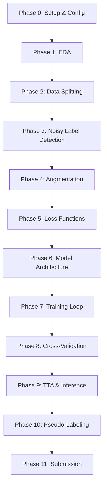

# Phase 0 — Project Overview, Configuration & Environment Setup

## 0.1 Competition Context

| Item | Detail |
|------|--------|
| **Competition** | OctWave 3.0 — Tom & Jerry Image Classification |
| **Task** | 4-class classification of cartoon frames |
| **Classes** | `0` = Neither, `1` = Tom only, `2` = Jerry only, `3` = Both |
| **Metric** | **Macro F1-Score** |
| **Train samples** | 2,680 (noisy labels, severe imbalance) |
| **Test samples** | 2,798 (clean labels) |
| **Total images** | 5,478 (shared `images/images/` folder) |
| **Submission** | CSV: `filename, appearance` |
| **Daily limit** | 20 submissions/day, **only 2 count** for final LB |

### Class Distribution (Train)

| Class | Label | Count | Percentage |
|-------|-------|-------|------------|
| 0 | Neither | 368 | 13.7% |
| 1 | Tom only | 1,252 | 46.7% |
| 2 | Jerry only | 841 | 31.4% |
| 3 | Both | 219 | 8.2% |

> [!WARNING]
> Class 3 (Both) has only 219 samples — **17.5% of the majority class**. Class 0 is also minority.
> The model will struggle most on classes 0 and 3. Macro F1 means each class weighs equally.

---

## 0.2 Project Directory Structure

```
Octwave_image_classification-/
├── Data/
│   └── oct-wave-3-0-kaggle-challenge-02/
│       ├── images/
│       │   └── images/          # All 5,478 .jpg files
│       ├── train.csv            # filename, appearance (2,680 rows)
│       ├── test.csv             # filename (2,798 rows)
│       └── sample_submission.csv
├── MD/                          # Competition docs
├── implementation/              # ← THIS: Phase-wise plans
└── src/                         # ← TO CREATE: All pipeline code
    ├── config.py                # Central config (YAML loader + defaults)
    ├── config.yaml              # Tunable hyperparameters
    ├── eda.py                   # Phase 1: Exploratory data analysis
    ├── data.py                  # Phase 2: Dataset, splits, loaders
    ├── noise.py                 # Phase 3: Noisy label detection
    ├── augment.py               # Phase 4: Augmentation pipeline
    ├── losses.py                # Phase 5: Loss functions
    ├── model.py                 # Phase 6: Model architecture
    ├── train.py                 # Phase 7: Training loop
    ├── crossval.py              # Phase 8: Cross-validation + ensembling
    ├── infer.py                 # Phase 9: Inference + TTA
    ├── pseudo.py                # Phase 10: Pseudo-labeling
    ├── submit.py                # Phase 11: Submission generation
    ├── utils.py                 # Shared utilities (metrics, logging, seeding)
    └── outputs/                 # Checkpoints, logs, submissions
        ├── checkpoints/
        ├── logs/
        ├── noisy_report/
        └── submissions/
```

---

## 0.3 Central Configuration System (`config.yaml`)

Design a single YAML config file that controls every knob in the pipeline. The `config.py` module loads it and exposes it as a dataclass/namespace.

### Full Config Schema

```yaml
# ============================================================
# config.yaml — Master Configuration
# ============================================================

# --- Paths ---
paths:
  data_root: "Data/oct-wave-3-0-kaggle-challenge-02"
  image_dir: "Data/oct-wave-3-0-kaggle-challenge-02/images/images"
  train_csv: "Data/oct-wave-3-0-kaggle-challenge-02/train.csv"
  test_csv: "Data/oct-wave-3-0-kaggle-challenge-02/test.csv"
  sample_sub: "Data/oct-wave-3-0-kaggle-challenge-02/sample_submission.csv"
  output_dir: "src/outputs"

# --- General ---
seed: 42
num_classes: 4
class_names: ["neither", "tom", "jerry", "both"]
device: "cuda"               # or "cpu"
num_workers: 4
pin_memory: true

# --- Data / Splitting ---
data:
  image_size: 224             # Resize target (224 for EfficientNet, 224 for Swin)
  val_ratio: 0.2
  n_folds: 5
  use_scene_grouping: true    # Phase 2: perceptual-hash grouping
  hash_threshold: 10          # Hamming distance threshold for grouping

# --- Augmentation ---
augmentation:
  strength: "medium"          # "light" | "medium" | "heavy"
  use_cutmix: true
  cutmix_alpha: 1.0
  use_mixup: true
  mixup_alpha: 0.4
  random_erasing_prob: 0.25
  minority_extra_aug: true    # Heavier aug for classes 0, 3

# --- Model ---
model:
  backbone: "efficientnetv2_s"  # Options: efficientnetv2_s, convnext_tiny, swin_tiny
  pretrained: true
  drop_rate: 0.3
  drop_path_rate: 0.2

# --- Training ---
training:
  epochs: 30
  batch_size: 32
  lr: 3.0e-4
  weight_decay: 1.0e-4
  label_smoothing: 0.1
  warmup_epochs: 3
  scheduler: "cosine"          # "cosine" | "onecycle"
  use_amp: true                # Mixed precision
  gradient_clip: 1.0
  # Two-phase fine-tuning
  freeze_backbone_epochs: 5    # Phase (a): frozen backbone
  backbone_lr_factor: 0.1      # Phase (b): discriminative LR

# --- Loss ---
loss:
  type: "focal"               # "focal" | "cross_entropy"
  focal_gamma: 2.0
  focal_alpha: null            # null = auto-compute from class weights
  use_class_weights: true

# --- Sampler ---
sampler:
  use_weighted_sampler: true

# --- Early Stopping ---
early_stopping:
  patience: 7
  min_delta: 0.001
  monitor: "val_macro_f1"

# --- Noisy Label Detection ---
noise:
  enabled: true
  loss_percentile: 95         # Flag top 5% loss samples
  confidence_threshold: 0.3   # Flag if max_prob < this
  exclude_flagged: false      # Set true after manual review
  relabel_csv: null            # Path to relabeled CSV if any

# --- Cross-Validation ---
crossval:
  n_folds: 5
  use_multi_backbone: true
  backbones: ["efficientnetv2_s", "convnext_tiny", "swin_tiny"]

# --- TTA ---
tta:
  enabled: true
  transforms: ["hflip", "crop_tl", "crop_tr", "crop_bl", "crop_br"]
  n_augments: 5

# --- Pseudo-Labeling ---
pseudo:
  enabled: false               # Toggle on after initial runs
  confidence_threshold: 0.9
  max_pseudo_samples: 500
  retrain_epochs: 15

# --- Submission ---
submission:
  output_name: "submission.csv"
  validate_against_sample: true
```

---

## 0.4 `config.py` — Implementation Spec

```
Module: src/config.py
```

### What to Build

1. **`load_config(path: str) -> dict`**
   - Load YAML file via `pyyaml`
   - Merge with hardcoded defaults (so missing keys don't crash)
   - Resolve relative paths to absolute based on project root

2. **`Config` dataclass (or `SimpleNamespace`)**
   - Nested access: `cfg.training.lr`, `cfg.model.backbone`
   - Pretty-print for logging

3. **`get_class_weights(train_csv: str) -> torch.Tensor`**
   - Compute inverse-frequency weights from `train.csv`
   - Normalize so weights sum to `num_classes`
   - Used by both loss and sampler

### Dependencies

```
torch>=2.0
timm>=0.9
albumentations>=1.3
opencv-python-headless
scikit-learn
pandas
numpy
matplotlib
seaborn
pyyaml
tqdm
imagehash      # For perceptual hashing (Phase 2)
Pillow
```

---

## 0.5 `utils.py` — Shared Utilities Spec

```
Module: src/utils.py
```

### Functions to Implement

| Function | Purpose |
|----------|---------|
| `set_seed(seed)` | Set seeds for `random`, `numpy`, `torch`, `torch.cuda`, `cudnn` |
| `compute_macro_f1(y_true, y_pred)` | Wrapper around `sklearn.metrics.f1_score(average='macro')` |
| `compute_per_class_f1(y_true, y_pred)` | Returns dict `{class_name: f1}` for logging |
| `plot_confusion_matrix(y_true, y_pred, class_names, save_path)` | Seaborn heatmap, save to file |
| `get_logger(name, log_dir)` | Python `logging` setup with file + console handlers |
| `AverageMeter` | Running average tracker for loss/metrics |
| `EarlyStopping` | Monitor `val_macro_f1`, save best model, stop after `patience` epochs |

---

## 0.6 Execution Order

> [!IMPORTANT]
> **The phases MUST be executed in this order.** Each phase depends on outputs from prior phases.



---

## 0.7 GPU Time Budget Estimate (Single Kaggle/Colab GPU)

| Phase | Estimated Time |
|-------|---------------|
| EDA | 5–10 min |
| Data splitting + hashing | 10–15 min |
| Noisy label baseline | 20–30 min |
| Single fold training (30 epochs) | 25–40 min |
| 5-fold CV (single backbone) | 2–3.5 hours |
| 3-backbone ensemble (5 folds each) | 6–10 hours |
| TTA inference | 10–15 min |
| Pseudo-labeling retrain | 1–2 hours |

> [!TIP]
> **For time-constrained runs:** Use 3 folds instead of 5, single backbone (EfficientNetV2-S), and skip pseudo-labeling. This brings total to ~2–3 hours.
