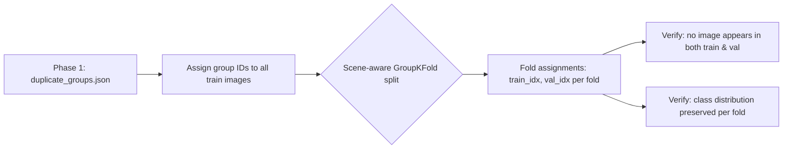

# Phase 2 — Scene-Aware Stratified Train/Validation Split

```
Module: src/data.py (splitting logic)
Priority: CRITICAL — leaky splits will give false confidence
GPU Required: No
Estimated Time: 10–15 minutes
Dependencies: Phase 1 outputs (duplicate_groups.json)
```

---

## 2.1 Problem Statement

> [!WARNING]
> **Naive random splitting is DANGEROUS here.**
> Frames were extracted at 1 FPS. Adjacent frames from the same scene are near-identical. A random 80/20 split will place near-duplicate frames in both train and val, causing **data leakage** and **inflated validation scores** that won't hold on the test set.

**Goal:** Split by scene groups so that all near-duplicate frames from the same scene end up in the same fold (either all in train or all in val).

---

## 2.2 Architecture Overview



---

## 2.3 Functions to Implement

### 2.3.1 `assign_group_ids(train_csv, duplicate_groups_json) -> pd.DataFrame`

**Purpose:** Assign a `group_id` to every training image.

**Implementation Details:**
1. Load `duplicate_groups.json` from Phase 1
2. For each image in `train.csv`:
   - If it belongs to a duplicate group → assign that group's ID
   - If it's a singleton (not in any group) → assign a unique group ID
3. Return DataFrame with columns: `filename, appearance, group_id`

**Output:** DataFrame with `group_id` column added.

**Sanity Check:**
- Number of unique groups should be significantly less than 2,680 (total train)
- Log: "Reduced 2,680 images into N groups (average M images/group)"

---

### 2.3.2 `create_scene_aware_folds(df, n_folds=5) -> list[tuple[np.array, np.array]]`

**Purpose:** Create K folds where no group is split across train/val.

**Implementation Details:**

**Primary Strategy — StratifiedGroupKFold:**
```python
from sklearn.model_selection import StratifiedGroupKFold

sgkf = StratifiedGroupKFold(n_splits=n_folds, shuffle=True, random_state=cfg.seed)
folds = []
for train_idx, val_idx in sgkf.split(df['filename'], df['appearance'], groups=df['group_id']):
    folds.append((train_idx, val_idx))
```

This simultaneously:
- Ensures no group spans train/val (anti-leakage)
- Stratifies by class label (preserves class ratios)

**Fallback Strategy — if `StratifiedGroupKFold` isn't available or grouping failed:**
```python
from sklearn.model_selection import StratifiedKFold

skf = StratifiedKFold(n_splits=n_folds, shuffle=True, random_state=cfg.seed)
folds = []
for train_idx, val_idx in skf.split(df['filename'], df['appearance']):
    folds.append((train_idx, val_idx))
```

> [!NOTE]
> `StratifiedGroupKFold` is available in scikit-learn ≥ 1.0. Use it as the primary strategy.

---

### 2.3.3 `validate_split(df, folds) -> bool`

**Purpose:** Verify the split integrity.

**Checks:**
1. **No group leakage:** For each fold, confirm that no `group_id` appears in both `train_idx` and `val_idx`
2. **Class ratios:** Print class distribution for train and val in each fold. They should be roughly proportional
3. **Val size:** Each fold's val should be ~20% of total

**Output Report:**
```
Fold 0:
  Train: 2144 samples | Val: 536 samples
  Train dist: {0: 294, 1: 1002, 2: 672, 3: 176}
  Val dist:   {0: 74, 1: 250, 2: 169, 3: 43}
  Group leakage: NONE ✓
  
Fold 1: ...
```

---

### 2.3.4 `TomJerryDataset(torch.utils.data.Dataset)`

**Purpose:** Custom PyTorch Dataset for image loading.

**Implementation Details:**

```python
class TomJerryDataset(Dataset):
    def __init__(self, df, image_dir, transform=None, is_test=False):
        """
        Args:
            df: DataFrame with 'filename' and optionally 'appearance' columns
            image_dir: Path to images/images/ folder
            transform: albumentations transform pipeline
            is_test: If True, don't return labels
        """
        self.df = df.reset_index(drop=True)
        self.image_dir = image_dir
        self.transform = transform
        self.is_test = is_test
    
    def __len__(self):
        return len(self.df)
    
    def __getitem__(self, idx):
        row = self.df.iloc[idx]
        img_path = os.path.join(self.image_dir, row['filename'])
        
        # Load image with OpenCV (BGR → RGB)
        image = cv2.imread(img_path)
        image = cv2.cvtColor(image, cv2.COLOR_BGR2RGB)
        
        # Apply augmentation
        if self.transform:
            augmented = self.transform(image=image)
            image = augmented['image']
        
        if self.is_test:
            return image, row['filename']
        
        label = int(row['appearance'])
        return image, label
```

**Key Design Decisions:**
- Use OpenCV for image loading (faster than PIL for albumentations)
- Return filenames for test set (needed for submission)
- Labels as integers, not one-hot (PyTorch CE loss expects class indices)

---

### 2.3.5 `create_dataloaders(train_df, val_df, cfg, train_transform, val_transform) -> tuple`

**Purpose:** Build train and val DataLoaders with optional weighted sampling.

**Implementation Details:**

```python
def create_dataloaders(train_df, val_df, cfg, train_transform, val_transform):
    train_dataset = TomJerryDataset(train_df, cfg.paths.image_dir, train_transform)
    val_dataset = TomJerryDataset(val_df, cfg.paths.image_dir, val_transform)
    
    # Optional: WeightedRandomSampler for class balance
    if cfg.sampler.use_weighted_sampler:
        class_counts = train_df['appearance'].value_counts().sort_index().values
        class_weights = 1.0 / class_counts
        sample_weights = [class_weights[label] for label in train_df['appearance']]
        sampler = WeightedRandomSampler(sample_weights, num_samples=len(train_df), replacement=True)
        shuffle = False  # Sampler handles ordering
    else:
        sampler = None
        shuffle = True
    
    train_loader = DataLoader(
        train_dataset,
        batch_size=cfg.training.batch_size,
        shuffle=shuffle,
        sampler=sampler,
        num_workers=cfg.num_workers,
        pin_memory=cfg.pin_memory,
        drop_last=True  # Prevent small last batch issues with BatchNorm
    )
    
    val_loader = DataLoader(
        val_dataset,
        batch_size=cfg.training.batch_size * 2,  # No grad → can use larger batch
        shuffle=False,
        num_workers=cfg.num_workers,
        pin_memory=cfg.pin_memory,
        drop_last=False
    )
    
    return train_loader, val_loader
```

---

## 2.4 Outputs

| Output | Description |
|--------|-------------|
| `fold_assignments` (in memory) | List of (train_idx, val_idx) tuples |
| `outputs/splits/fold_report.txt` | Per-fold class distribution + leakage check |
| `outputs/splits/fold_assignments.json` | Serialized fold indices for reproducibility |

---

## 2.5 Critical Validation

> [!CAUTION]
> Before proceeding to Phase 3, verify:
> 1. **Zero group leakage** across all folds
> 2. **Class ratios** in val match overall distribution (±2%)
> 3. **Val size** is 15–25% per fold
> 4. If using 5 folds → each image appears in exactly 1 val fold across all 5

---

## 2.6 Design Decisions

| Decision | Choice | Rationale |
|----------|--------|-----------|
| Split method | `StratifiedGroupKFold` | Prevents leakage + preserves class ratios |
| Number of folds | 5 (configurable) | Standard; 3 if GPU-constrained |
| Image loading | OpenCV | Faster than PIL, native albumentation support |
| Val batch size | 2× train batch | No gradients stored → more memory available |
| `drop_last=True` (train) | Yes | Prevents BatchNorm issues with batch_size=1 |
