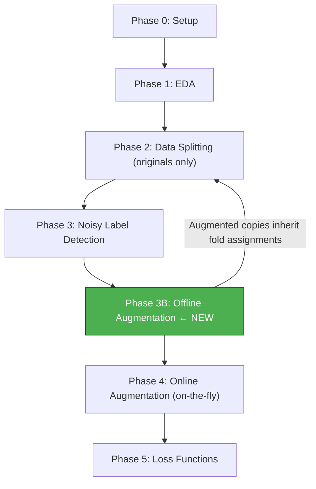

# Phase 3B — Offline Data Augmentation & Resolution Optimization

```
Module: src/offline_augment.py
Priority: CRITICAL — 2,680 samples is too small; must expand before training
GPU Required: No (CPU-based image transforms)
Estimated Time: 5–15 minutes (one-time generation)
Dependencies: Phase 3 (noise detection — augment ONLY clean samples)
```

---

## 3B.1 Problem Statement

> [!WARNING]
> **2,680 training images is dangerously small** for fine-tuning a deep CNN. With only 219 samples in Class 3 and 368 in Class 0, the model will severely underfit on minority classes regardless of loss weighting.

**Solution:** **Offline augmentation** — physically create new image files by applying geometric and color transforms to existing images. This is different from online augmentation (Phase 4) which applies random transforms on-the-fly during each epoch.

**Why both offline AND online augmentation?**

| Type | What it does | Benefit |
|------|-------------|---------|
| **Offline** (this phase) | Creates permanent new image files on disk | Increases dataset size, balances classes |
| **Online** (Phase 4) | Applies random transforms during training per epoch | Each epoch sees different variations, prevents memorization |

Combined: each offline-augmented copy gets further randomized by online augmentation → **massive effective diversity**.

---

## 3B.2 Target Dataset Size

**Strategy:** Upsample minority classes to roughly match the majority class count.

| Class | Original | Augmentation Multiplier | Target Count | New Files to Create |
|-------|----------|------------------------|--------------|---------------------|
| 0 (Neither) | 368 | 4× | ~1,472 | ~1,104 |
| 1 (Tom) | 1,252 | 1× (no offline aug) | 1,252 | 0 |
| 2 (Jerry) | 841 | 2× | ~1,682 | ~841 |
| 3 (Both) | 219 | 6× | ~1,314 | ~1,095 |
| **Total** | **2,680** | — | **~5,720** | **~3,040** |

> [!TIP]
> We intentionally do NOT augment Class 1 (majority). This balances the dataset without creating redundant copies of already-abundant samples. The target is roughly **equal representation** (~1,200–1,700 per class).

---

## 3B.3 Resolution Optimization

### Resolution Strategy: Two-Tier Approach

| Phase | Resolution | Purpose |
|-------|-----------|---------|
| **Experimentation** (fast runs) | **192×192** | ~30% faster training, good enough for hyperparameter search |
| **Final submission** (best quality) | **224×224** | Full detail, best accuracy for ensemble |

### Why 192×192 for Fast Runs?

| Resolution | Pixels | vs 224 | Training Speed | Accuracy Impact |
|-----------|--------|--------|----------------|-----------------|
| 160×160 | 25,600 | −49% | ~2× faster | −2–4% F1 (too much detail loss for Jerry) |
| **192×192** | 36,864 | **−31%** | **~1.4× faster** | **−0.5–1% F1 (acceptable)** |
| 224×224 | 50,176 | baseline | baseline | baseline |
| 256×256 | 65,536 | +31% | ~1.3× slower | +0.3–0.5% F1 (diminishing returns) |

> [!IMPORTANT]
> **Jerry is a small character.** Going below 192×192 risks losing details needed to distinguish Jerry-present vs Jerry-absent frames. Do NOT use 160×160 for final submissions.

---

## 3B.4 Functions to Implement

### 3B.4.1 `generate_offline_augmentations(train_df, image_dir, output_dir, cfg) -> pd.DataFrame`

**Purpose:** Create augmented copies of minority class images on disk.

```python
import albumentations as A
import cv2
import os
import numpy as np
from tqdm import tqdm

def generate_offline_augmentations(train_df, image_dir, output_dir, cfg):
    """
    Generate offline augmented copies of training images.
    
    - Class 0: 4 augmented copies per image
    - Class 1: 0 (skip majority class)
    - Class 2: 2 augmented copies per image
    - Class 3: 6 augmented copies per image
    
    Augmented images are saved to output_dir with naming:
        {original_name}_aug{i}.jpg
    
    Returns:
        pd.DataFrame: Updated train DataFrame including augmented samples
    """
    os.makedirs(output_dir, exist_ok=True)
    
    # Augmentation multipliers per class
    multipliers = cfg.offline_aug.class_multipliers  # {0: 4, 1: 0, 2: 2, 3: 6}
    
    # Define offline augmentation transforms (geometric + color, NO normalize/resize)
    offline_transforms = get_offline_transforms()
    
    augmented_rows = []
    
    for _, row in tqdm(train_df.iterrows(), total=len(train_df), desc="Offline augmentation"):
        cls = row['appearance']
        n_copies = multipliers.get(cls, 0)
        
        if n_copies == 0:
            continue
        
        # Load original image at full resolution
        img_path = os.path.join(image_dir, row['filename'])
        image = cv2.imread(img_path)
        if image is None:
            continue
        image = cv2.cvtColor(image, cv2.COLOR_BGR2RGB)
        
        for aug_idx in range(n_copies):
            # Apply random transform
            augmented = offline_transforms(image=image)
            aug_image = augmented['image']
            
            # Save augmented image
            base_name = os.path.splitext(row['filename'])[0]
            aug_filename = f"{base_name}_aug{aug_idx}.jpg"
            aug_path = os.path.join(output_dir, aug_filename)
            
            # Save with quality control (not too high to save space)
            aug_bgr = cv2.cvtColor(aug_image, cv2.COLOR_RGB2BGR)
            cv2.imwrite(aug_path, aug_bgr, [cv2.IMWRITE_JPEG_QUALITY, 90])
            
            augmented_rows.append({
                'filename': aug_filename,
                'appearance': cls,
                'is_augmented': True,
                'source_file': row['filename']
            })
    
    # Create augmented DataFrame
    aug_df = pd.DataFrame(augmented_rows)
    
    # Mark original samples
    train_df = train_df.copy()
    train_df['is_augmented'] = False
    train_df['source_file'] = train_df['filename']
    
    # Combine
    combined_df = pd.concat([train_df, aug_df], ignore_index=True)
    
    # Report
    print(f"\n{'='*60}")
    print("OFFLINE AUGMENTATION COMPLETE")
    print(f"{'='*60}")
    print(f"Original samples:  {len(train_df)}")
    print(f"Augmented copies:  {len(aug_df)}")
    print(f"Total dataset:     {len(combined_df)}")
    print(f"\nNew class distribution:")
    for cls in range(cfg.num_classes):
        orig = (train_df['appearance'] == cls).sum()
        aug = (aug_df['appearance'] == cls).sum() if len(aug_df) > 0 else 0
        total = orig + aug
        print(f"  {cfg.class_names[cls]}: {orig} + {aug} aug = {total}")
    
    # Save the combined CSV
    combined_df.to_csv(os.path.join(cfg.paths.output_dir, "train_augmented.csv"), index=False)
    
    return combined_df
```

---

### 3B.4.2 `get_offline_transforms() -> A.Compose`

**Purpose:** Define the transforms for offline augmentation. These should be **diverse but realistic** — we want meaningful variations, not noise.

```python
def get_offline_transforms():
    """
    Transforms for offline augmentation.
    
    KEY PRINCIPLE: Each augmented copy should look like a plausible
    frame from the show, not a distorted mess.
    
    We use a ReplayCompose so each copy gets a DIFFERENT random
    combination of transforms.
    """
    return A.Compose([
        # --- Geometric transforms (change viewpoint/framing) ---
        A.OneOf([
            A.HorizontalFlip(p=1.0),
            A.ShiftScaleRotate(
                shift_limit=0.08, scale_limit=0.15, rotate_limit=15,
                border_mode=cv2.BORDER_REFLECT_101, p=1.0
            ),
            A.RandomResizedCrop(
                height=480, width=640,  # Will be resized later during training
                scale=(0.75, 1.0), ratio=(0.85, 1.15), p=1.0
            ),
            A.Perspective(scale=(0.02, 0.06), p=1.0),
        ], p=0.9),
        
        # --- Color transforms (change lighting/palette) ---
        A.OneOf([
            A.RandomBrightnessContrast(
                brightness_limit=0.25, contrast_limit=0.25, p=1.0
            ),
            A.HueSaturationValue(
                hue_shift_limit=15, sat_shift_limit=25, val_shift_limit=20, p=1.0
            ),
            A.ColorJitter(
                brightness=0.2, contrast=0.2, saturation=0.2, hue=0.08, p=1.0
            ),
            A.CLAHE(clip_limit=3.0, p=1.0),
        ], p=0.8),
        
        # --- Quality transforms (simulate different capture conditions) ---
        A.OneOf([
            A.GaussianBlur(blur_limit=(3, 5), p=1.0),
            A.GaussNoise(var_limit=(5, 30), p=1.0),
            A.ImageCompression(quality_lower=70, quality_upper=95, p=1.0),
        ], p=0.3),
    ])
```

**Transform Rationale:**

| Transform Type | What It Simulates | Why It Helps |
|----------------|-------------------|-------------|
| HorizontalFlip | Mirror scene | Doubles viewpoint diversity |
| ShiftScaleRotate | Camera movement, zoom | Different framing of same content |
| RandomResizedCrop | Different aspect ratios | Teaches model to handle cropped views |
| Perspective | Slight 3D distortion | Robustness to viewpoint changes |
| BrightnessContrast | Different TV brightness settings | Color invariance |
| HueSaturationValue | Different color reproduction | Handle color palette variations across episodes |
| CLAHE | Local contrast enhancement | Highlights details in dark scenes |
| GaussianBlur/Noise | Lower quality capture | Robustness to quality variation |

---

### 3B.4.3 `validate_augmented_images(aug_df, output_dir, cfg)`

**Purpose:** Spot-check augmented images to ensure quality.

```python
def validate_augmented_images(aug_df, output_dir, cfg):
    """
    Visual validation: show original + augmented copies side by side.
    
    Creates a grid for 3 random samples from each minority class.
    """
    fig, axes = plt.subplots(3 * 3, 7, figsize=(28, 18))  # 3 classes × 3 samples × 7 columns
    
    minority_classes = [0, 2, 3]
    
    for cls_idx, cls in enumerate(minority_classes):
        cls_originals = aug_df[(aug_df['appearance'] == cls) & (~aug_df['is_augmented'])]
        samples = cls_originals.sample(3, random_state=42)
        
        for sample_idx, (_, row) in enumerate(samples.iterrows()):
            row_idx = cls_idx * 3 + sample_idx
            
            # Show original
            orig_path = os.path.join(cfg.paths.image_dir, row['filename'])
            orig = cv2.imread(orig_path)
            orig = cv2.cvtColor(orig, cv2.COLOR_BGR2RGB)
            axes[row_idx, 0].imshow(orig)
            axes[row_idx, 0].set_title(f"ORIGINAL\n{row['filename']}", fontsize=8)
            axes[row_idx, 0].axis('off')
            
            # Show augmented copies
            aug_copies = aug_df[aug_df['source_file'] == row['filename']]
            for aug_idx, (_, aug_row) in enumerate(aug_copies.head(6).iterrows()):
                aug_path = os.path.join(output_dir, aug_row['filename'])
                aug_img = cv2.imread(aug_path)
                if aug_img is not None:
                    aug_img = cv2.cvtColor(aug_img, cv2.COLOR_BGR2RGB)
                    axes[row_idx, aug_idx + 1].imshow(aug_img)
                axes[row_idx, aug_idx + 1].set_title(f"Aug #{aug_idx}", fontsize=8)
                axes[row_idx, aug_idx + 1].axis('off')
    
    plt.suptitle("Offline Augmentation Validation: Original → Augmented Copies", fontsize=14)
    plt.tight_layout()
    plt.savefig(f"{cfg.paths.output_dir}/augmentation/offline_aug_validation.png", dpi=150)
    plt.close()
    print("Validation grid saved to outputs/augmentation/offline_aug_validation.png")
```

---

### 3B.4.4 `optimize_resolution(image_dir, train_df, cfg) -> int`

**Purpose:** Analyze images and recommend optimal resolution.

```python
def optimize_resolution(image_dir, train_df, cfg):
    """
    Analyze image dimensions and recommend training resolution.
    
    Returns recommended resolution as int.
    """
    # Sample dimensions
    widths, heights = [], []
    for _, row in train_df.sample(min(200, len(train_df))).iterrows():
        img = cv2.imread(os.path.join(image_dir, row['filename']))
        if img is not None:
            h, w = img.shape[:2]
            widths.append(w)
            heights.append(h)
    
    avg_w, avg_h = np.mean(widths), np.mean(heights)
    min_dim = min(np.min(widths), np.min(heights))
    
    print(f"\nImage dimension analysis:")
    print(f"  Average: {avg_w:.0f} × {avg_h:.0f}")
    print(f"  Min dimension: {min_dim}")
    
    # Resolution recommendations
    if cfg.training.fast_mode:
        recommended = 192
        print(f"\n  → FAST MODE: Using 192×192 (~30% faster training)")
    else:
        recommended = 224
        print(f"\n  → QUALITY MODE: Using 224×224 (full detail)")
    
    if min_dim < 192:
        print(f"  ⚠ Some images are smaller than {recommended}px — upscaling will occur")
    
    return recommended
```

---

## 3B.5 Integration with Phase 2 (Splitting)

> [!CAUTION]
> **Augmented copies MUST stay in the same fold as their source image.**
> If `img_abc.jpg` is in the training fold, all `img_abc_aug0.jpg`, `img_abc_aug1.jpg`, etc. must also be in training — NEVER in validation.

**Implementation:**
```python
# In data.py — when creating folds, use source_file for grouping
def assign_augmented_to_folds(combined_df, folds):
    """
    Ensure augmented copies inherit their source image's fold assignment.
    
    Args:
        combined_df: DataFrame with 'source_file' column
        folds: List of (train_idx, val_idx) from original split
    """
    updated_folds = []
    for train_idx, val_idx in folds:
        # Get source filenames in train and val
        train_sources = set(combined_df.iloc[train_idx]['source_file'])
        val_sources = set(combined_df.iloc[val_idx]['source_file'])
        
        # Assign augmented copies to same fold as their source
        new_train_mask = combined_df['source_file'].isin(train_sources)
        new_val_mask = combined_df['source_file'].isin(val_sources)
        
        new_train_idx = combined_df[new_train_mask].index.values
        new_val_idx = combined_df[new_val_mask & ~combined_df['is_augmented']].index.values
        # NOTE: Augmented copies go ONLY to train, NEVER to val
        
        updated_folds.append((new_train_idx, new_val_idx))
    
    return updated_folds
```

> [!IMPORTANT]
> **Validation set must contain ONLY original (non-augmented) images.** Augmented copies in validation would inflate metrics and not reflect true generalization.

---

## 3B.6 Disk Space Estimate

| Item | Count | Avg Size | Total |
|------|-------|----------|-------|
| Original images | 5,478 | ~80 KB | ~430 MB |
| Augmented copies | ~3,040 | ~75 KB (JPEG 90) | ~225 MB |
| **Total** | **~8,518** | — | **~655 MB** |

---

## 3B.7 Configuration Knobs

```yaml
# Add to config.yaml
offline_aug:
  enabled: true
  output_dir: "Data/oct-wave-3-0-kaggle-challenge-02/images/augmented"
  class_multipliers:
    0: 4    # Neither: 368 → ~1,472
    1: 0    # Tom: 1,252 (no augmentation needed)
    2: 2    # Jerry: 841 → ~1,682
    3: 6    # Both: 219 → ~1,314
  jpeg_quality: 90

resolution:
  fast_mode: 192          # For experimentation / hyperparameter search
  quality_mode: 224       # For final submission runs
  use_fast_mode: false    # Toggle: true = 192, false = 224
```

---

## 3B.8 Updated Execution Order



**The flow is:**
1. Phase 3 detects noisy labels → produces clean training set
2. Phase 3B takes the **clean** training set and generates offline augmented copies for minority classes
3. Phase 4's online augmentation applies on top of everything (originals + offline copies)

---

## 3B.9 Expected Impact

| Metric | Before Offline Aug | After Offline Aug |
|--------|-------------------|-------------------|
| Total train samples | 2,680 | ~5,720 |
| Class 0 count | 368 | ~1,472 |
| Class 3 count | 219 | ~1,314 |
| Class balance ratio (max/min) | 5.7× | ~1.3× |
| Expected Macro F1 improvement | baseline | +2–5% |
| Training time per epoch | baseline | ~1.5× (more data) |

> [!TIP]
> **Net effect on total GPU time:** Even though each epoch processes more images (~2.1× more), the model converges faster because the balanced data gives clearer gradients. You often need fewer total epochs. At 192×192 resolution, the per-epoch speedup from smaller images partially offsets the larger dataset size.

---

## 3B.10 Manual Review Checkpoint

> [!CAUTION]
> After running offline augmentation:
> 1. Open `outputs/augmentation/offline_aug_validation.png`
> 2. Verify augmented copies look like **realistic cartoon frames**
> 3. Ensure characters are still visible and recognizable after transforms
> 4. If any transforms produce artifacts (black borders, extreme distortion), adjust parameters
