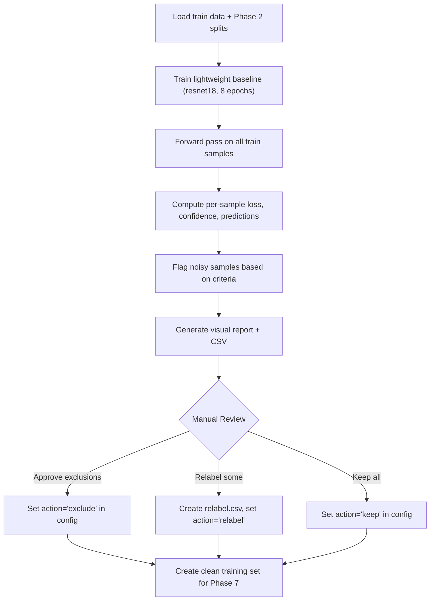

# Phase 3 — Noisy Label Detection & Cleaning

```
Module: src/noise.py
Priority: HIGH — noisy labels directly degrade Macro F1
GPU Required: Yes (trains a quick baseline)
Estimated Time: 20–30 minutes
Dependencies: Phase 2 (splits + dataloaders)
```

---

## 3.1 Problem Statement

> [!WARNING]
> The competition explicitly states: **"Training data is noisy"** and **"Test data is 100% clean."**
> Noisy labels will mislead the model, especially for minority classes (0, 3) where even a few wrong labels can significantly skew predictions.

**Goal:** Identify likely mislabeled training samples, generate a human-reviewable report, and support excluding or relabeling them before the final training run.

---

## 3.2 Approach: Confidence Learning

The strategy is to train a lightweight baseline model, then use its predictions on the training data to identify samples that the model consistently disagrees with. This is based on the principle that:
- Correctly labeled samples will eventually have **low loss** and **high confidence** on the correct class
- Mislabeled samples will have **persistently high loss** and **low confidence** — the model "wants" to predict differently

---

## 3.3 Functions to Implement

### 3.3.1 `train_noise_detector(train_df, val_df, cfg) -> dict`

**Purpose:** Train a quick baseline to compute per-sample statistics.

**Implementation Details:**
1. Use a **lightweight backbone** (e.g., `resnet18` or `efficientnet_b0`) — faster than the competition model
2. Train for **5–10 epochs** with standard settings (no advanced augmentation, no fancy loss)
3. Use simple CrossEntropyLoss (no label smoothing, no focal loss)
4. After training, run **forward pass on the entire training set** (no augmentation, just resize + normalize)
5. For each training sample, record:
   - **Per-sample loss** (CE loss on that sample)
   - **Predicted class** (argmax of logits)
   - **Max softmax probability** (confidence)
   - **Softmax vector** (full probability distribution)
   - **Whether prediction matches label** (agree/disagree)

**Output:** DataFrame with columns:
```
filename | true_label | predicted_label | loss | max_prob | agree | prob_0 | prob_1 | prob_2 | prob_3
```

---

### 3.3.2 `flag_noisy_samples(noise_df, cfg) -> pd.DataFrame`

**Purpose:** Flag samples as potentially mislabeled.

**Flagging Criteria (flag if ANY of these are true):**

| Criterion | Threshold | Rationale |
|-----------|-----------|-----------|
| **High loss** | Top `cfg.noise.loss_percentile`% (default: 5%) | Model can't fit these |
| **Low confidence** | `max_prob < cfg.noise.confidence_threshold` (default: 0.3) | Model is very uncertain |
| **Strong disagreement** | Model predicts a different class with `max_prob > 0.7` | Model is confident it's a different class |

**Additional heuristic — Cross-fold disagreement:**
- If using K-fold: run noise detection on each fold's model
- Flag samples where ≥ 2 out of 3 fold models disagree with the label
- This is more robust than single-model detection

**Output columns added to DataFrame:**
```
flag_high_loss | flag_low_conf | flag_disagreement | is_flagged | suggested_label
```

---

### 3.3.3 `generate_noise_report(flagged_df, image_dir, save_dir)`

**Purpose:** Create a human-reviewable report for manual inspection.

**Outputs:**

1. **`outputs/noisy_report/noise_summary.txt`**
   ```
   === Noisy Label Detection Report ===
   Total training samples: 2,680
   Total flagged: X (Y%)
   
   Flagged by class:
     Class 0 (Neither): N0 flagged out of 368
     Class 1 (Tom):     N1 flagged out of 1,252
     Class 2 (Jerry):   N2 flagged out of 841
     Class 3 (Both):    N3 flagged out of 219
   
   Flag reasons:
     High loss only:        A
     Low confidence only:   B
     Strong disagreement:   C
     Multiple reasons:      D
   ```

2. **`outputs/noisy_report/flagged_samples.csv`**
   - Full DataFrame of flagged samples with all columns
   - Sorted by loss (descending) — worst offenders first
   - Includes `suggested_label` (model's prediction) for relabeling reference

3. **`outputs/noisy_report/flagged_grid_{class}.png`** (one per class)
   - Grid of flagged images for each class
   - Each image titled: `{filename} | Label: {true} → Model: {predicted} (conf: {max_prob:.2f})`
   - Helps human reviewer quickly spot obvious mislabels

4. **`outputs/noisy_report/confusion_on_flagged.png`**
   - Confusion matrix: true labels vs predicted labels for flagged samples only
   - Shows common mislabel patterns (e.g., class 3 mislabeled as class 1)

---

### 3.3.4 `create_clean_training_set(train_csv, flagged_csv, action, relabel_csv=None) -> pd.DataFrame`

**Purpose:** Produce a cleaned training DataFrame for the final training run.

**Actions supported:**

| Action | Description |
|--------|-------------|
| `"exclude"` | Remove all flagged samples entirely |
| `"relabel"` | Replace labels using `relabel_csv` (manually corrected) |
| `"keep"` | Keep everything (use original noisy data) |
| `"soft"` | Keep flagged samples but with reduced weight in loss (0.5× weight) |

**Implementation:**
```python
def create_clean_training_set(train_csv, flagged_csv, action="exclude", relabel_csv=None):
    train_df = pd.read_csv(train_csv)
    flagged_df = pd.read_csv(flagged_csv)
    flagged_files = set(flagged_df['filename'])
    
    if action == "exclude":
        clean_df = train_df[~train_df['filename'].isin(flagged_files)]
    elif action == "relabel":
        relabel = pd.read_csv(relabel_csv)  # filename, corrected_label
        relabel_map = dict(zip(relabel['filename'], relabel['corrected_label']))
        train_df['appearance'] = train_df.apply(
            lambda r: relabel_map.get(r['filename'], r['appearance']), axis=1
        )
        clean_df = train_df
    elif action == "soft":
        train_df['sample_weight'] = train_df['filename'].apply(
            lambda f: 0.5 if f in flagged_files else 1.0
        )
        clean_df = train_df
    else:  # "keep"
        clean_df = train_df
    
    return clean_df
```

---

## 3.4 Configuration Knobs

```yaml
noise:
  enabled: true
  baseline_backbone: "resnet18"    # Lightweight for speed
  baseline_epochs: 8
  loss_percentile: 95              # Flag top 5% loss
  confidence_threshold: 0.3        # Flag if max_prob < this
  disagreement_threshold: 0.7      # Flag if model confident on different class
  exclude_flagged: false           # Set true after manual review
  action: "keep"                   # "keep" | "exclude" | "relabel" | "soft"
  relabel_csv: null
```

---

## 3.5 Execution Flow



---

## 3.6 Manual Review Checkpoint

> [!CAUTION]
> **STOP and manually review before proceeding to Phase 4.**
>
> 1. Open `outputs/noisy_report/flagged_grid_{class}.png` for each class
> 2. For each flagged image, decide:
>    - Is it truly mislabeled? → Add to `relabel.csv`
>    - Is it borderline/ambiguous? → Exclude it
>    - Is the model wrong, label is correct? → Keep it
> 3. Update `config.yaml`:
>    - Set `noise.action` to your chosen strategy
>    - If relabeling, create the relabel CSV and set `noise.relabel_csv`
>
> **Estimated manual review time:** 15–30 minutes for reviewing 50–150 flagged images.

---

## 3.7 Expected Impact

| Strategy | Expected Effect on Macro F1 |
|----------|---------------------------|
| Keep all (baseline) | Baseline |
| Exclude flagged (~5%) | +0.5–2% improvement |
| Relabel flagged | +1–3% improvement |
| Soft downweight | +0.3–1% improvement |

> [!TIP]
> For time-constrained runs: Use `action="exclude"` without manual review. This is a quick win that removes the most egregious mislabels. Manual relabeling gives better results but takes time.
