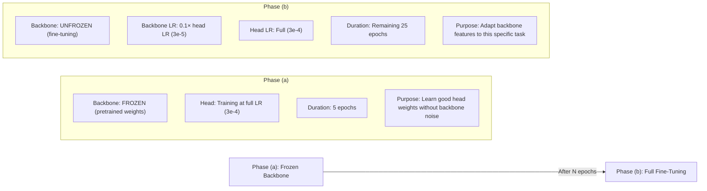

# Phase 6 — Model Architecture (Transfer Learning via timm)

```
Module: src/model.py
Priority: CRITICAL — the model is the core of the pipeline
GPU Required: Yes (for model instantiation and testing)
Estimated Time: Implementation only
Dependencies: Phase 0 (config)
```

---

## 6.1 Objective

Build a flexible model wrapper that:
1. Supports **swapping backbones** via config: EfficientNetV2-S, ConvNeXt-Tiny, Swin-Tiny
2. Implements **two-phase fine-tuning**: frozen backbone → full fine-tuning
3. Uses **discriminative learning rates** (lower LR for early layers)
4. Replaces the classifier head for 4-class output

---

## 6.2 Backbone Options

| Backbone | timm Name | Params | ImageNet Top-1 | Speed (imgs/sec, T4) | Recommended For |
|----------|-----------|--------|---------------|----------------------|-----------------|
| EfficientNetV2-S | `tf_efficientnetv2_s` | 21.5M | 83.9% | ~450 | **Default** — best speed/accuracy tradeoff |
| ConvNeXt-Tiny | `convnext_tiny` | 28.6M | 82.1% | ~400 | Strong CNN alternative |
| Swin-Tiny | `swin_tiny_patch4_window7_224` | 28.3M | 81.3% | ~350 | Vision Transformer diversity for ensemble |

> [!TIP]
> **For single-model runs:** Use EfficientNetV2-S (fastest, highest accuracy).
> **For ensembles:** Use all three to get architecture diversity — reduces correlated errors.

---

## 6.3 Functions to Implement

### 6.3.1 `TomJerryClassifier(nn.Module)`

**Main model class:**

```python
import timm
import torch
import torch.nn as nn

class TomJerryClassifier(nn.Module):
    def __init__(self, cfg):
        """
        Args:
            cfg: Config with model.backbone, model.pretrained, model.drop_rate,
                 model.drop_path_rate, num_classes
        """
        super().__init__()
        
        self.cfg = cfg
        backbone_name = self._resolve_backbone_name(cfg.model.backbone)
        
        # Create backbone via timm
        self.backbone = timm.create_model(
            backbone_name,
            pretrained=cfg.model.pretrained,
            drop_rate=cfg.model.drop_rate,
            drop_path_rate=cfg.model.drop_path_rate,
            num_classes=0  # Remove original classifier head
        )
        
        # Get feature dimension from backbone
        self.feature_dim = self.backbone.num_features
        
        # Custom classifier head
        self.head = nn.Sequential(
            nn.BatchNorm1d(self.feature_dim),
            nn.Dropout(p=cfg.model.drop_rate),
            nn.Linear(self.feature_dim, 512),
            nn.ReLU(inplace=True),
            nn.BatchNorm1d(512),
            nn.Dropout(p=cfg.model.drop_rate * 0.5),
            nn.Linear(512, cfg.num_classes)
        )
        
        # Initialize head weights
        self._init_head()
    
    def _resolve_backbone_name(self, name):
        """Map friendly names to timm model names."""
        mapping = {
            "efficientnetv2_s": "tf_efficientnetv2_s",
            "convnext_tiny": "convnext_tiny",
            "swin_tiny": "swin_tiny_patch4_window7_224",
        }
        return mapping.get(name, name)  # Allow direct timm names too
    
    def _init_head(self):
        """Kaiming initialization for the custom head."""
        for m in self.head.modules():
            if isinstance(m, nn.Linear):
                nn.init.kaiming_normal_(m.weight, mode='fan_out', nonlinearity='relu')
                if m.bias is not None:
                    nn.init.constant_(m.bias, 0)
            elif isinstance(m, nn.BatchNorm1d):
                nn.init.constant_(m.weight, 1)
                nn.init.constant_(m.bias, 0)
    
    def forward(self, x):
        features = self.backbone(x)  # (B, feature_dim)
        logits = self.head(features)  # (B, num_classes)
        return logits
    
    def freeze_backbone(self):
        """Freeze all backbone parameters for Phase (a) training."""
        for param in self.backbone.parameters():
            param.requires_grad = False
        print(f"Backbone frozen. Trainable params: {self.count_trainable_params():,}")
    
    def unfreeze_backbone(self):
        """Unfreeze all backbone parameters for Phase (b) training."""
        for param in self.backbone.parameters():
            param.requires_grad = True
        print(f"Backbone unfrozen. Trainable params: {self.count_trainable_params():,}")
    
    def count_trainable_params(self):
        return sum(p.numel() for p in self.parameters() if p.requires_grad)
    
    def count_total_params(self):
        return sum(p.numel() for p in self.parameters())
```

---

### 6.3.2 `get_optimizer_with_discriminative_lr(model, cfg) -> torch.optim.Optimizer`

**Purpose:** Different learning rates for backbone vs head. Lower LR for pretrained backbone prevents destroying learned features.

```python
def get_optimizer_with_discriminative_lr(model, cfg):
    """
    Create AdamW optimizer with discriminative learning rates:
    - Head parameters: cfg.training.lr (full LR)
    - Backbone parameters: cfg.training.lr * cfg.training.backbone_lr_factor (reduced LR)
    
    This is used during Phase (b) — full fine-tuning.
    """
    # Separate parameters into backbone and head
    backbone_params = list(model.backbone.parameters())
    head_params = list(model.head.parameters())
    
    param_groups = [
        {
            'params': backbone_params,
            'lr': cfg.training.lr * cfg.training.backbone_lr_factor,  # e.g., 3e-5
            'name': 'backbone'
        },
        {
            'params': head_params,
            'lr': cfg.training.lr,  # e.g., 3e-4
            'name': 'head'
        }
    ]
    
    optimizer = torch.optim.AdamW(
        param_groups,
        weight_decay=cfg.training.weight_decay
    )
    
    return optimizer


def get_head_only_optimizer(model, cfg):
    """
    Optimizer for Phase (a) — only train the head.
    """
    return torch.optim.AdamW(
        model.head.parameters(),
        lr=cfg.training.lr,
        weight_decay=cfg.training.weight_decay
    )
```

---

### 6.3.3 `get_scheduler(optimizer, cfg, steps_per_epoch) -> _LRScheduler`

**Purpose:** Learning rate schedule.

```python
def get_scheduler(optimizer, cfg, steps_per_epoch):
    """
    Create LR scheduler based on config.
    
    Options:
    - "cosine": CosineAnnealingWarmRestarts with linear warmup
    - "onecycle": OneCycleLR (auto warmup)
    """
    total_steps = cfg.training.epochs * steps_per_epoch
    warmup_steps = cfg.training.warmup_epochs * steps_per_epoch
    
    if cfg.training.scheduler == "onecycle":
        scheduler = torch.optim.lr_scheduler.OneCycleLR(
            optimizer,
            max_lr=[group['lr'] for group in optimizer.param_groups],
            total_steps=total_steps,
            pct_start=cfg.training.warmup_epochs / cfg.training.epochs,
            anneal_strategy='cos',
            div_factor=25,        # initial_lr = max_lr / 25
            final_div_factor=1e4  # final_lr = max_lr / 10000
        )
        scheduler_type = "step"  # Call per step
    
    elif cfg.training.scheduler == "cosine":
        # Linear warmup + cosine decay
        def lr_lambda(step):
            if step < warmup_steps:
                return step / max(1, warmup_steps)
            progress = (step - warmup_steps) / max(1, total_steps - warmup_steps)
            return 0.5 * (1 + math.cos(math.pi * progress))
        
        scheduler = torch.optim.lr_scheduler.LambdaLR(optimizer, lr_lambda)
        scheduler_type = "step"
    
    return scheduler, scheduler_type
```

---

## 6.4 Two-Phase Fine-Tuning Strategy



### Phase Transition Logic (in `train.py`)

```python
for epoch in range(cfg.training.epochs):
    if epoch == 0:
        # Phase (a): Freeze backbone, train head only
        model.freeze_backbone()
        optimizer = get_head_only_optimizer(model, cfg)
        scheduler, _ = get_scheduler(optimizer, cfg, len(train_loader))
    
    elif epoch == cfg.training.freeze_backbone_epochs:
        # Phase (b): Unfreeze backbone, discriminative LR
        model.unfreeze_backbone()
        optimizer = get_optimizer_with_discriminative_lr(model, cfg)
        scheduler, _ = get_scheduler(optimizer, cfg, len(train_loader))
        print(f"\n{'='*50}")
        print(f"Phase (b): Backbone unfrozen at epoch {epoch}")
        print(f"Backbone LR: {cfg.training.lr * cfg.training.backbone_lr_factor}")
        print(f"Head LR:     {cfg.training.lr}")
        print(f"{'='*50}\n")
    
    # ... training loop
```

---

## 6.5 Feature Dimensions by Backbone

| Backbone | `num_features` | Head Input Dim |
|----------|---------------|----------------|
| EfficientNetV2-S | 1280 | 1280 |
| ConvNeXt-Tiny | 768 | 768 |
| Swin-Tiny | 768 | 768 |

---

## 6.6 Model Summary Helper

```python
def print_model_summary(model, cfg):
    """Print model architecture summary."""
    print(f"\n{'='*60}")
    print(f"Model: {cfg.model.backbone}")
    print(f"Backbone features: {model.feature_dim}")
    print(f"Total parameters: {model.count_total_params():,}")
    print(f"Trainable parameters: {model.count_trainable_params():,}")
    print(f"Dropout rate: {cfg.model.drop_rate}")
    print(f"Drop path rate: {cfg.model.drop_path_rate}")
    print(f"{'='*60}\n")
```

---

## 6.7 Configuration Knobs

```yaml
model:
  backbone: "efficientnetv2_s"    # "efficientnetv2_s" | "convnext_tiny" | "swin_tiny"
  pretrained: true
  drop_rate: 0.3                  # Dropout in head
  drop_path_rate: 0.2             # Stochastic depth in backbone

training:
  freeze_backbone_epochs: 5       # Phase (a) duration
  backbone_lr_factor: 0.1         # Phase (b) backbone LR = lr × this
  lr: 3.0e-4                      # Head LR
  weight_decay: 1.0e-4
```

---

## 6.8 Verification Checklist

- [ ] Model instantiates successfully for all 3 backbones
- [ ] Forward pass works: random input `(B, 3, 224, 224)` → output `(B, 4)`
- [ ] Freeze/unfreeze correctly changes trainable param count
- [ ] Discriminative LR optimizer shows different LRs for backbone vs head
- [ ] Pretrained weights load without errors
