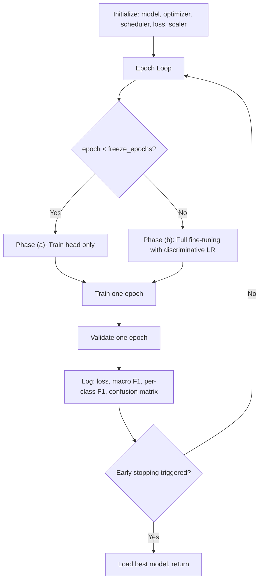

# Phase 7 — Training Loop

```
Module: src/train.py
Priority: CRITICAL — where everything comes together
GPU Required: Yes
Estimated Time: 5–9 min per fold @ 128×128 (exploration), 30–50 min @ 224×224 (final)
Dependencies: Phases 2–6 (data, augmentation, loss, model)
Key Changes (Optimization Update):
  - Added configurable validation frequency: val_every_n_epochs (§13)
  - Added GPU memory tracking per epoch (§14)
  - Added training time tracking per epoch (§14)
  - Added ExperimentTracker logging to CSV (§14)
  - Updated CutMix/MixUp to be individually toggleable (§3, §14)
  - Updated LR starting points (§9: head LR ≈ 1e-3, fine-tune LR ≈ 1e-4)
```

---

## 7.1 Objective

Build a production-grade training loop with:
1. **Mixed precision (AMP)** for 2× speedup (§6)
2. **Two-stage transfer learning** (frozen → full) (§9)
3. **CutMix/MixUp** integration (individually toggleable, §3)
4. **Per-class F1 logging** at validation steps
5. **Confusion matrix** per validation step
6. **Early stopping** on validation Macro F1 (not loss) (§12)
7. **Gradient clipping** for stability
8. **Validation frequency control** (§13: every N epochs during exploration)
9. **GPU memory + training time tracking** (§14)
10. **Experiment logging** to CSV (§14)

---

## 7.2 Training Loop Architecture



---

## 7.3 Functions to Implement

### 7.3.1 `train_one_epoch(model, loader, criterion, optimizer, scheduler, scaler, cfg, epoch)`

**Purpose:** Train for one epoch with AMP, CutMix/MixUp, and gradient clipping.

```python
def train_one_epoch(model, loader, criterion, optimizer, scheduler, scaler, cfg, epoch):
    """
    Train for one epoch.
    
    Returns:
        dict: {'loss': avg_loss, 'lr': current_lr}
    """
    model.train()
    loss_meter = AverageMeter()
    
    pbar = tqdm(loader, desc=f"Train Epoch {epoch}")
    for batch_idx, (images, labels) in enumerate(pbar):
        images = images.to(cfg.device, non_blocking=True)
        labels = labels.to(cfg.device, non_blocking=True)
        
        # ---- CutMix / MixUp (batch-level augmentation, §3) ----
        # NOTE: Only one of CutMix or MixUp should be enabled at a time (§14)
        use_mix = False
        if epoch >= cfg.training.freeze_backbone_epochs:  # Only after warmup
            r = np.random.rand()
            if cfg.augmentation.use_cutmix and r < 0.5:
                images, labels_a, labels_b, lam = cutmix_data(
                    images, labels, cfg.augmentation.cutmix_alpha
                )
                use_mix = True
            elif cfg.augmentation.use_mixup and r < 0.5:
                images, labels_a, labels_b, lam = mixup_data(
                    images, labels, cfg.augmentation.mixup_alpha
                )
                use_mix = True
        
        # ---- Forward pass with AMP ----
        optimizer.zero_grad(set_to_none=True)
        
        with torch.cuda.amp.autocast(enabled=cfg.training.use_amp):
            outputs = model(images)
            if use_mix:
                loss = mixup_criterion(criterion, outputs, labels_a, labels_b, lam)
            else:
                loss = criterion(outputs, labels)
        
        # ---- Backward pass with scaled gradients ----
        scaler.scale(loss).backward()
        
        # ---- Gradient clipping ----
        if cfg.training.gradient_clip > 0:
            scaler.unscale_(optimizer)
            torch.nn.utils.clip_grad_norm_(
                model.parameters(), cfg.training.gradient_clip
            )
        
        scaler.step(optimizer)
        scaler.update()
        
        # ---- Step scheduler (if per-step) ----
        if scheduler is not None:
            scheduler.step()
        
        # ---- Logging ----
        loss_meter.update(loss.item(), images.size(0))
        current_lr = optimizer.param_groups[-1]['lr']
        pbar.set_postfix({
            'loss': f'{loss_meter.avg:.4f}',
            'lr': f'{current_lr:.6f}'
        })
    
    return {
        'loss': loss_meter.avg,
        'lr': optimizer.param_groups[-1]['lr']
    }
```

---

### 7.3.2 `validate_one_epoch(model, loader, criterion, cfg, epoch)`

**Purpose:** Validate and compute comprehensive metrics.

```python
@torch.no_grad()
def validate_one_epoch(model, loader, criterion, cfg, epoch):
    """
    Validate for one epoch.
    
    Returns:
        dict: {
            'loss': avg_loss,
            'macro_f1': float,
            'per_class_f1': {class_name: f1},
            'all_preds': np.array,
            'all_labels': np.array,
            'all_probs': np.array
        }
    """
    model.eval()
    loss_meter = AverageMeter()
    all_preds = []
    all_labels = []
    all_probs = []
    
    for images, labels in tqdm(loader, desc=f"Val Epoch {epoch}"):
        images = images.to(cfg.device, non_blocking=True)
        labels = labels.to(cfg.device, non_blocking=True)
        
        with torch.cuda.amp.autocast(enabled=cfg.training.use_amp):
            outputs = model(images)
            loss = criterion(outputs, labels)
        
        probs = torch.softmax(outputs, dim=1)
        preds = probs.argmax(dim=1)
        
        loss_meter.update(loss.item(), images.size(0))
        all_preds.append(preds.cpu().numpy())
        all_labels.append(labels.cpu().numpy())
        all_probs.append(probs.cpu().numpy())
    
    all_preds = np.concatenate(all_preds)
    all_labels = np.concatenate(all_labels)
    all_probs = np.concatenate(all_probs)
    
    # Compute metrics
    macro_f1 = compute_macro_f1(all_labels, all_preds)
    per_class_f1 = compute_per_class_f1(all_labels, all_preds)
    
    return {
        'loss': loss_meter.avg,
        'macro_f1': macro_f1,
        'per_class_f1': per_class_f1,
        'all_preds': all_preds,
        'all_labels': all_labels,
        'all_probs': all_probs
    }
```

---

### 7.3.3 `train_fold(fold_idx, train_df, val_df, cfg) -> dict`

**Purpose:** Full training pipeline for one fold.

```python
def train_fold(fold_idx, train_df, val_df, cfg):
    """
    Complete training for one fold.
    
    Returns:
        dict: {
            'best_macro_f1': float,
            'best_epoch': int,
            'best_model_path': str,
            'history': list of epoch metrics,
            'total_time_seconds': float,
            'peak_gpu_memory_mb': float
        }
    """
    import time
    fold_start_time = time.time()
    
    print(f"\n{'='*60}")
    print(f"FOLD {fold_idx}")
    print(f"Train: {len(train_df)} | Val: {len(val_df)}")
    print(f"Resolution: {cfg.resolution.current}×{cfg.resolution.current}")
    print(f"{'='*60}\n")
    
    # ---- 1. Create transforms ----
    train_transform = get_train_transform(cfg)
    val_transform = get_val_transform(cfg)
    
    # ---- 2. Create dataloaders ----
    train_loader, val_loader = create_dataloaders(
        train_df, val_df, cfg, train_transform, val_transform
    )
    
    # ---- 3. Create model ----
    model = TomJerryClassifier(cfg).to(cfg.device)
    print_model_summary(model, cfg)
    
    # ---- 4. Create loss function ----
    class_weights = compute_class_weights(train_df)
    criterion = get_loss_function(cfg, class_weights).to(cfg.device)
    
    # ---- 5. Create AMP scaler ----
    scaler = torch.cuda.amp.GradScaler(enabled=cfg.training.use_amp)
    
    # ---- 6. Early stopping ----
    early_stopper = EarlyStopping(
        patience=cfg.early_stopping.patience,
        min_delta=cfg.early_stopping.min_delta
    )
    
    # ---- 7. Training loop ----
    history = []
    best_f1 = 0.0
    best_epoch = 0
    best_model_path = None
    peak_gpu_mb = 0.0
    
    for epoch in range(cfg.training.epochs):
        epoch_start = time.time()
        
        # Phase transition (§9: Two-stage transfer learning)
        if epoch == 0:
            model.freeze_backbone()
            optimizer = get_head_only_optimizer(model, cfg)
            scheduler, _ = get_scheduler(optimizer, cfg, len(train_loader))
        elif epoch == cfg.training.freeze_backbone_epochs:
            model.unfreeze_backbone()
            optimizer = get_optimizer_with_discriminative_lr(model, cfg)
            scheduler, _ = get_scheduler(optimizer, cfg, len(train_loader))
        
        # Train
        train_metrics = train_one_epoch(
            model, train_loader, criterion, optimizer, scheduler, scaler, cfg, epoch
        )
        
        # ---- Validation frequency control (§13) ----
        # During exploration: validate every N epochs to save time
        # During final training: validate every epoch
        should_validate = (
            epoch % cfg.experiment.val_every_n_epochs == 0 or
            epoch == cfg.training.epochs - 1 or
            epoch == cfg.training.freeze_backbone_epochs  # Always validate at phase transition
        )
        
        if should_validate:
            val_metrics = validate_one_epoch(
                model, val_loader, criterion, cfg, epoch
            )
            
            # ---- Log metrics ----
            print(f"\nEpoch {epoch}/{cfg.training.epochs-1}")
            print(f"  Train Loss: {train_metrics['loss']:.4f} | LR: {train_metrics['lr']:.6f}")
            print(f"  Val Loss:   {val_metrics['loss']:.4f}")
            print(f"  Val Macro F1: {val_metrics['macro_f1']:.4f}")
            print(f"  Per-class F1:")
            for cls_name, f1 in val_metrics['per_class_f1'].items():
                marker = " ← DRAGGING" if f1 < val_metrics['macro_f1'] - 0.05 else ""
                print(f"    {cls_name}: {f1:.4f}{marker}")
            
            # ---- Confusion matrix ----
            cm_path = f"{cfg.paths.output_dir}/logs/fold{fold_idx}_epoch{epoch}_cm.png"
            plot_confusion_matrix(
                val_metrics['all_labels'], val_metrics['all_preds'],
                cfg.class_names, cm_path
            )
            
            # ---- Save best model ----
            if val_metrics['macro_f1'] > best_f1:
                best_f1 = val_metrics['macro_f1']
                best_epoch = epoch
                best_model_path = f"{cfg.paths.output_dir}/checkpoints/fold{fold_idx}_best.pt"
                torch.save({
                    'epoch': epoch,
                    'model_state_dict': model.state_dict(),
                    'optimizer_state_dict': optimizer.state_dict(),
                    'scheduler_state_dict': scheduler.state_dict(),
                    'scaler_state_dict': scaler.state_dict(),
                    'macro_f1': best_f1,
                    'per_class_f1': val_metrics['per_class_f1'],
                    'cfg': cfg,
                    'fold': fold_idx,
                    'backbone': cfg.model.backbone
                }, best_model_path)
                print(f"  ★ New best model saved! F1={best_f1:.4f}")
            
            # ---- Early stopping ----
            early_stopper(val_metrics['macro_f1'])
            if early_stopper.should_stop:
                print(f"\nEarly stopping at epoch {epoch}. Best F1={best_f1:.4f} at epoch {best_epoch}")
                break
        else:
            # Skip validation, just log training loss
            print(f"Epoch {epoch}: Train Loss={train_metrics['loss']:.4f} (validation skipped, §13)")
            val_metrics = None
        
        # ---- GPU memory tracking (§14) ----
        if torch.cuda.is_available():
            gpu_mb = torch.cuda.max_memory_allocated() / 1024 / 1024
            peak_gpu_mb = max(peak_gpu_mb, gpu_mb)
        
        epoch_time = time.time() - epoch_start
        
        history.append({
            'epoch': epoch,
            'train_loss': train_metrics['loss'],
            'val_loss': val_metrics['loss'] if val_metrics else None,
            'val_macro_f1': val_metrics['macro_f1'] if val_metrics else None,
            'epoch_time_seconds': epoch_time,
            'gpu_memory_mb': peak_gpu_mb,
            **({
                f'f1_{k}': v for k, v in val_metrics['per_class_f1'].items()
            } if val_metrics else {})
        })
    
    total_time = time.time() - fold_start_time
    
    return {
        'best_macro_f1': best_f1,
        'best_epoch': best_epoch,
        'best_model_path': best_model_path,
        'history': history,
        'total_time_seconds': total_time,
        'peak_gpu_memory_mb': peak_gpu_mb
    }
```

---

### 7.3.4 `plot_training_history(history, fold_idx, save_dir)`

**Purpose:** Plot training curves after fold completes.

**Plots to generate:**
1. **Loss curve:** Train loss + Val loss vs epoch
2. **F1 curve:** Macro F1 + per-class F1 vs epoch
3. **LR schedule:** Learning rate vs epoch (showing warmup + decay)

Save to: `outputs/logs/fold{fold_idx}_training_curves.png`

---

## 7.4 Key Training Parameters

| Parameter | Value | Rationale |
|-----------|-------|-----------|
| **Optimizer** | AdamW | Better generalization than Adam (decoupled weight decay) (§10) |
| **Head LR** | 1e-3 (Stage 1) | Higher for classification head (§9) |
| **Fine-tune LR** | 1e-4 (Stage 2) | Lower to preserve pretrained features (§9) |
| **Backbone LR** | 1e-5 (Stage 2) | fine_tune_lr × backbone_lr_factor (§9) |
| **Weight decay** | 1e-4 | Regularization (§10) |
| **Epochs** | 30 | With early stopping, usually converges in 15–25 |
| **Batch size** | 32 | Fits on T4/P100; increase to 64 if memory allows |
| **AMP** | Enabled | ~2× speedup, minimal accuracy loss (§6) |
| **Gradient clip** | 1.0 | Prevents gradient explosion during fine-tuning transition |
| **Label smoothing** | 0.1 | Regularization + noisy label robustness (§10) |
| **Val frequency** | Every 1–3 epochs | 2–3 during exploration, 1 during final (§13) |

---

## 7.5 Logging Format

Every epoch should print:
```
Epoch 12/29
  Train Loss: 0.4523 | LR: 0.000127
  Val Loss:   0.6821
  Val Macro F1: 0.7234
  Per-class F1:
    neither: 0.6812
    tom:     0.8234
    jerry:   0.7523  
    both:    0.6367 ← DRAGGING
  ★ New best model saved! F1=0.7234
```

> [!IMPORTANT]
> The `← DRAGGING` marker flags classes pulling down the Macro F1. This tells you which class needs more attention (heavier augmentation, more samples, different loss weighting).

---

## 7.6 Checkpoint Format

```python
checkpoint = {
    'epoch': epoch,
    'model_state_dict': model.state_dict(),
    'optimizer_state_dict': optimizer.state_dict(),
    'scheduler_state_dict': scheduler.state_dict(),
    'scaler_state_dict': scaler.state_dict(),
    'macro_f1': best_f1,
    'per_class_f1': val_metrics['per_class_f1'],
    'cfg': cfg,  # For reproducibility
    'fold': fold_idx,
    'backbone': cfg.model.backbone
}
```

---

## 7.7 Configuration Knobs

```yaml
training:
  epochs: 30
  batch_size: 32
  lr: 1.0e-3                     # Head LR for Stage 1 (§9)
  fine_tune_lr: 1.0e-4            # Fine-tuning LR for Stage 2 (§9)
  weight_decay: 1.0e-4            # AdamW regularization (§10)
  label_smoothing: 0.1            # Range: 0.05–0.1 (§10)
  warmup_epochs: 3
  scheduler: "cosine"             # "cosine" | "onecycle" | "plateau" (§11)
  use_amp: true                   # Mixed precision (§6)
  gradient_clip: 1.0
  freeze_backbone_epochs: 5       # Stage 1 duration (§9)
  backbone_lr_factor: 0.1         # Stage 2 backbone LR = fine_tune_lr × this

early_stopping:
  patience: 7
  min_delta: 0.001
  monitor: "val_macro_f1"         # Primary selection metric (§12)

experiment:
  name: "baseline"                # Current experiment name (§14)
  log_file: "src/outputs/experiments/experiment_log.csv"
  val_every_n_epochs: 1           # 2–3 during exploration, 1 during final (§13)
```

---

## 7.8 GPU Memory Estimates

| Backbone | Batch 32 | Batch 64 | Batch 128 |
|----------|----------|----------|-----------|
| EfficientNetV2-S | ~6 GB | ~10 GB | ~18 GB |
| ConvNeXt-Tiny | ~7 GB | ~12 GB | ~20 GB |
| Swin-Tiny | ~8 GB | ~14 GB | ~22 GB |

> [!TIP]
> Kaggle T4 GPU has 16 GB. Use batch_size=32 to be safe. Colab A100 can use 64.
> If OOM, reduce batch_size or use `gradient_accumulation_steps`.
