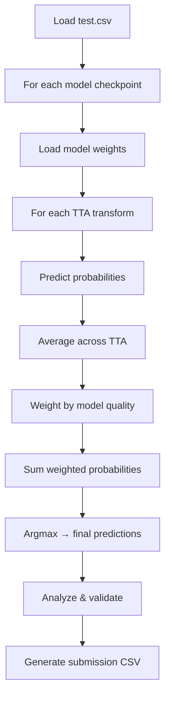

# Phase 9 — Test-Time Augmentation (TTA) & Inference

```
Module: src/infer.py
Priority: HIGH — TTA is a free performance boost at inference
GPU Required: Yes
Estimated Time: 2–5 minutes for ensemble + TTA (hflip only)
Dependencies: Phase 8 (trained models)
Key Changes (Optimization Update):
  - Simplified default TTA to just horizontal flip (§15)
  - Corner crops removed from default (add only if measured improvement)
  - Added validation step: only keep TTA if it improves val Macro F1
  - TTA disabled by default until best model is found
```

---

## 9.1 Objective

Run inference on the test set with:
1. **Test-Time Augmentation (TTA)** — multiple augmented views per image, average predictions
2. **Multi-model ensemble** — average across all fold/backbone models
3. Combine TTA + ensemble for maximum performance

---

## 9.2 TTA Strategy

> [!NOTE]
> **Optimization Update (§15):** TTA should use only **light transforms**. Do not use aggressive transformations. Start with just horizontal flip, add more only if measured improvement.

For each test image, create augmented versions and average their predictions:

| TTA Transform | Description | Default? |
|---------------|-------------|----------|
| **Original** | Standard resize + normalize (always included) | ✓ Always |
| **Horizontal flip** | Mirror image left-right | ✓ Default |
| Light color jitter | Slight brightness/contrast variation | Optional |
| ~~Top-left crop~~ | ~~Crop 90% from top-left~~ | Removed from default |
| ~~Other corner crops~~ | ~~Various 90% crops~~ | Removed from default |

**Default predictions per image per model:** 2 (1 original + 1 hflip)

> [!IMPORTANT]
> **Validate TTA benefit (§15):** After applying TTA, compare validation Macro F1 with and without TTA. Only keep TTA if it provides measurable improvement. The validation step should be:
> 1. Predict on validation set WITHOUT TTA → record Macro F1
> 2. Predict on validation set WITH TTA → record Macro F1
> 3. Keep TTA only if F1(with TTA) > F1(without TTA)

---

## 9.3 Functions to Implement

### 9.3.1 `get_tta_transforms(cfg) -> list[A.Compose]`

**Purpose:** Create list of TTA transforms.

```python
def get_tta_transforms(cfg):
    """
    Create list of TTA transforms. Each produces a differently-augmented
    view of the same image.
    """
    img_size = cfg.resolution.current  # Uses progressive resizing
    norm = A.Normalize(mean=[0.485, 0.456, 0.406], std=[0.229, 0.224, 0.225])
    
    tta_list = []
    
    # 1. Original (always included)
    tta_list.append(A.Compose([
        A.Resize(img_size, img_size),
        norm,
        ToTensorV2(),
    ]))
    
    if not cfg.tta.enabled:
        return tta_list
    
    # 2. Horizontal flip
    if "hflip" in cfg.tta.transforms:
        tta_list.append(A.Compose([
            A.Resize(img_size, img_size),
            A.HorizontalFlip(p=1.0),  # Always flip for TTA
            norm,
            ToTensorV2(),
        ]))
        
    # 3. Optional Light Color Jitter (only if added after validation)
    if "color_jitter" in cfg.tta.transforms:
        tta_list.append(A.Compose([
            A.Resize(img_size, img_size),
            A.RandomBrightnessContrast(brightness_limit=0.1, contrast_limit=0.1, p=1.0),
            norm,
            ToTensorV2(),
        ]))
    
    print(f"TTA: {len(tta_list)} transforms configured")
    return tta_list
```

---

### 9.3.2 `predict_with_tta(model, test_df, cfg) -> np.array`

**Purpose:** Run TTA inference for a single model.

```python
@torch.no_grad()
def predict_with_tta(model, test_df, cfg):
    """
    Predict test set with TTA.
    
    For each TTA transform, run full inference on the test set,
    then average the softmax probabilities.
    
    Returns:
        np.array: (N_test, num_classes) averaged softmax probabilities
    """
    model.eval()
    tta_transforms = get_tta_transforms(cfg)
    
    all_tta_probs = []
    
    for tta_idx, transform in enumerate(tta_transforms):
        print(f"  TTA {tta_idx + 1}/{len(tta_transforms)}...")
        
        dataset = TomJerryDataset(test_df, cfg.paths.image_dir, transform, is_test=True)
        loader = DataLoader(
            dataset, batch_size=cfg.training.batch_size * 2,
            shuffle=False, num_workers=cfg.dataloader.num_workers,
            pin_memory=cfg.dataloader.pin_memory
        )
        
        batch_probs = []
        for images, filenames in loader:
            images = images.to(cfg.device, non_blocking=True)
            with torch.cuda.amp.autocast(enabled=cfg.training.use_amp):
                outputs = model(images)
            probs = torch.softmax(outputs, dim=1)
            batch_probs.append(probs.cpu().numpy())
        
        tta_probs = np.concatenate(batch_probs)  # (N_test, 4)
        all_tta_probs.append(tta_probs)
    
    # Average across TTA transforms
    avg_probs = np.mean(all_tta_probs, axis=0)  # (N_test, 4)
    
    return avg_probs
```

---

### 9.3.3 `ensemble_predict(model_paths, test_df, cfg) -> np.array`

**Purpose:** Ensemble predictions from multiple models + TTA.

```python
def ensemble_predict(model_paths, test_df, cfg, weights=None):
    """
    Run ensemble inference: load each model, predict with TTA, average.
    
    Args:
        model_paths: List of checkpoint paths
        test_df: Test DataFrame
        cfg: Config
        weights: Optional model weights (from CV F1). None = equal weights.
    
    Returns:
        np.array: (N_test, num_classes) final ensemble probabilities
    """
    if weights is None:
        weights = np.ones(len(model_paths)) / len(model_paths)
    else:
        weights = np.array(weights) / np.sum(weights)
    
    print(f"\nEnsemble inference with {len(model_paths)} models...")
    
    all_model_probs = []
    
    for i, ckpt_path in enumerate(model_paths):
        print(f"\nModel {i + 1}/{len(model_paths)}: {os.path.basename(ckpt_path)}")
        
        # Load model (auto-detect backbone from checkpoint)
        checkpoint = torch.load(ckpt_path, map_location=cfg.device)
        model_cfg = checkpoint.get('cfg', cfg)
        model = TomJerryClassifier(model_cfg).to(cfg.device)
        model.load_state_dict(checkpoint['model_state_dict'])
        
        # Predict with TTA
        model_probs = predict_with_tta(model, test_df, cfg)
        all_model_probs.append(model_probs)
        
        # Free GPU memory
        del model
        torch.cuda.empty_cache()
    
    # Weighted average across models
    ensemble_probs = np.zeros_like(all_model_probs[0])
    for probs, w in zip(all_model_probs, weights):
        ensemble_probs += w * probs
    
    return ensemble_probs
```

---

### 9.3.4 `analyze_predictions(probs, test_df, cfg)`

**Purpose:** Post-inference analysis before generating submission.

```python
def analyze_predictions(probs, test_df, cfg):
    """
    Analyze prediction confidence and distribution.
    Helps decide if the model is well-calibrated.
    """
    predictions = probs.argmax(axis=1)
    max_probs = probs.max(axis=1)
    
    print(f"\n{'='*50}")
    print("PREDICTION ANALYSIS")
    print(f"{'='*50}")
    
    # 1. Predicted class distribution
    print("\nPredicted class distribution (test set):")
    for cls in range(cfg.num_classes):
        count = (predictions == cls).sum()
        pct = count / len(predictions) * 100
        print(f"  {cfg.class_names[cls]}: {count} ({pct:.1f}%)")
    
    # 2. Confidence distribution
    print(f"\nConfidence statistics:")
    print(f"  Mean: {max_probs.mean():.4f}")
    print(f"  Median: {np.median(max_probs):.4f}")
    print(f"  Min: {max_probs.min():.4f}")
    print(f"  < 0.5: {(max_probs < 0.5).sum()} samples")
    print(f"  < 0.7: {(max_probs < 0.7).sum()} samples")
    print(f"  > 0.9: {(max_probs > 0.9).sum()} samples")
    
    # 3. Save confidence histogram
    plt.figure(figsize=(10, 6))
    plt.hist(max_probs, bins=50, edgecolor='black')
    plt.xlabel('Max Softmax Probability')
    plt.ylabel('Count')
    plt.title('Prediction Confidence Distribution')
    plt.savefig(f"{cfg.paths.output_dir}/predictions/confidence_dist.png", dpi=150, bbox_inches='tight')
    plt.close()
    
    return predictions, max_probs
```

---

## 9.4 Inference Pipeline



---

## 9.5 Configuration Knobs

```yaml
tta:
  enabled: false               # CHANGED: only enable after best model found (§15)
  transforms: ["hflip"]        # CHANGED: start with just hflip (§15)
  # Optional: ["hflip", "color_jitter"]
  # Corner crops removed from default — add only if measured improvement
```

---

## 9.6 Performance Impact

| Method | Expected Improvement |
|--------|---------------------|
| Single model, no TTA | Baseline |
| Single model + TTA (6 views) | +0.5–1.5% Macro F1 |
| 5-fold ensemble, no TTA | +1–3% Macro F1 |
| 5-fold ensemble + TTA | +1.5–4% Macro F1 |
| 15-model multi-backbone + TTA | +2–5% Macro F1 |

---

## 9.7 Time Estimates

| Setup | Inference Time (T4 GPU) |
|-------|------------------------|
| 1 model, no TTA | ~30 seconds |
| 1 model, 6× TTA | ~3 minutes |
| 5 models, 6× TTA | ~15 minutes |
| 15 models, 6× TTA | ~45 minutes |

> [!TIP]
> **Default TTA (§15):** Use just original + hflip (2 transforms). This gives ~80% of the TTA benefit in ~33% of the time compared to 6-transform TTA.
> **Only add more transforms** if validation shows measurable Macro F1 improvement.
