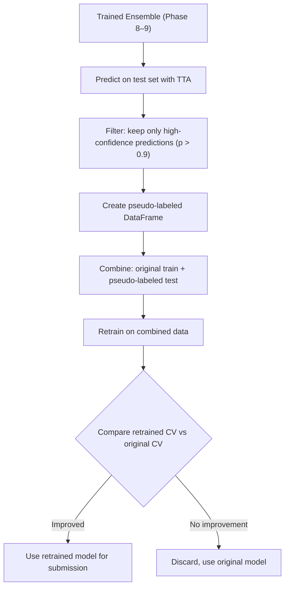
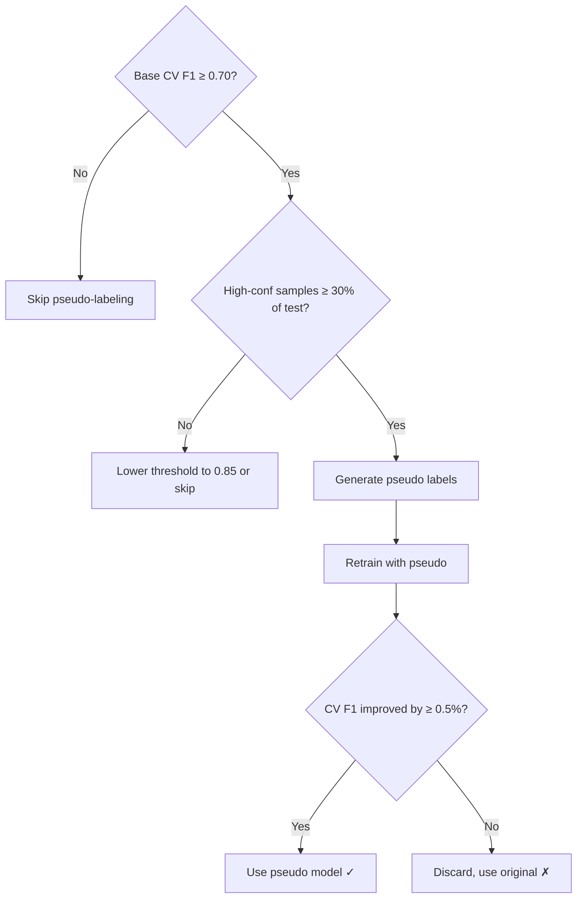

# Phase 10 — Pseudo-Labeling (Optional Second Pass)

```
Module: src/pseudo.py
Priority: MEDIUM — optional, only if base ensemble is strong
GPU Required: Yes
Estimated Time: 1–2 hours
Dependencies: Phase 8–9 (trained ensemble + test predictions)
```

---

## 10.1 Objective

Use the trained ensemble to generate pseudo-labels for the test set, then retrain with combined data to potentially improve generalization.

> [!WARNING]
> **Pseudo-labeling is high-risk, high-reward.** If your base model is poor, you'll propagate errors. Only proceed if:
> 1. Your base CV Macro F1 is ≥ 0.70
> 2. High-confidence test predictions (max_prob > 0.9) cover ≥ 30% of test set
> 3. Retrained model shows **improved local CV**, not just lower loss

---

## 10.2 Approach



---

## 10.3 Functions to Implement

### 10.3.1 `generate_pseudo_labels(ensemble_probs, test_df, cfg) -> pd.DataFrame`

**Purpose:** Select high-confidence test predictions as pseudo-labels.

```python
def generate_pseudo_labels(ensemble_probs, test_df, cfg):
    """
    Generate pseudo-labels from ensemble predictions.
    
    Args:
        ensemble_probs: (N_test, 4) softmax probabilities from ensemble + TTA
        test_df: Test DataFrame with filenames
        cfg: Config
    
    Returns:
        pd.DataFrame: Pseudo-labeled samples (filename, appearance, pseudo_confidence)
    """
    threshold = cfg.pseudo.confidence_threshold  # e.g., 0.9
    max_samples = cfg.pseudo.max_pseudo_samples  # e.g., 500
    
    max_probs = ensemble_probs.max(axis=1)
    pred_labels = ensemble_probs.argmax(axis=1)
    
    # Filter by confidence threshold
    high_conf_mask = max_probs >= threshold
    
    pseudo_df = test_df[high_conf_mask].copy()
    pseudo_df['appearance'] = pred_labels[high_conf_mask]
    pseudo_df['pseudo_confidence'] = max_probs[high_conf_mask]
    pseudo_df['is_pseudo'] = True
    
    # Limit total pseudo samples
    if len(pseudo_df) > max_samples:
        pseudo_df = pseudo_df.nlargest(max_samples, 'pseudo_confidence')
    
    # Report
    print(f"\n{'='*50}")
    print("PSEUDO-LABELING REPORT")
    print(f"{'='*50}")
    print(f"Confidence threshold: {threshold}")
    print(f"Test samples above threshold: {high_conf_mask.sum()} / {len(test_df)} ({high_conf_mask.sum()/len(test_df)*100:.1f}%)")
    print(f"Selected pseudo samples: {len(pseudo_df)}")
    print(f"\nPseudo label distribution:")
    for cls in range(cfg.num_classes):
        count = (pseudo_df['appearance'] == cls).sum()
        print(f"  {cfg.class_names[cls]}: {count}")
    print(f"\nMean confidence: {pseudo_df['pseudo_confidence'].mean():.4f}")
    print(f"Min confidence:  {pseudo_df['pseudo_confidence'].min():.4f}")
    
    return pseudo_df
```

---

### 10.3.2 `create_pseudo_training_set(train_df, pseudo_df, cfg) -> pd.DataFrame`

**Purpose:** Combine original training data with pseudo-labeled test data.

```python
def create_pseudo_training_set(train_df, pseudo_df, cfg):
    """
    Combine original training data with pseudo-labeled samples.
    
    Pseudo samples get reduced weight (0.5x) to avoid overriding
    real labels.
    """
    # Mark original samples
    train_df = train_df.copy()
    train_df['is_pseudo'] = False
    train_df['sample_weight'] = 1.0
    
    # Prepare pseudo samples
    pseudo_df = pseudo_df.copy()
    pseudo_df['sample_weight'] = 0.5  # Reduced weight
    
    # Combine
    combined_df = pd.concat([
        train_df[['filename', 'appearance', 'is_pseudo', 'sample_weight']],
        pseudo_df[['filename', 'appearance', 'is_pseudo', 'sample_weight']]
    ], ignore_index=True)
    
    print(f"\nCombined dataset:")
    print(f"  Original train: {len(train_df)}")
    print(f"  Pseudo samples: {len(pseudo_df)}")
    print(f"  Total: {len(combined_df)}")
    print(f"\nNew class distribution:")
    for cls in range(cfg.num_classes):
        orig = (train_df['appearance'] == cls).sum()
        pseudo = (pseudo_df['appearance'] == cls).sum()
        print(f"  {cfg.class_names[cls]}: {orig} + {pseudo} pseudo = {orig + pseudo}")
    
    return combined_df
```

---

### 10.3.3 `retrain_with_pseudo(combined_df, cfg) -> dict`

**Purpose:** Retrain the model on combined data and validate.

```python
def retrain_with_pseudo(combined_df, cfg):
    """
    Retrain using combined data (original + pseudo).
    
    Key differences from normal training:
    1. Use only original (non-pseudo) samples for validation
    2. Reduce epoch count (cfg.pseudo.retrain_epochs)
    3. Use sample weights to downweight pseudo labels
    
    Returns:
        dict with retrained model results and comparison
    """
    # Split: only use original samples for validation folds
    original_df = combined_df[~combined_df['is_pseudo']]
    
    # Create folds on original data only
    folds = create_scene_aware_folds(original_df, cfg.crossval.n_folds)
    
    pseudo_results = []
    
    for fold_idx, (train_idx, val_idx) in enumerate(folds):
        # Training set = original train fold + ALL pseudo samples
        fold_train = original_df.iloc[train_idx]
        fold_val = original_df.iloc[val_idx]
        
        # Add pseudo samples to training
        pseudo_only = combined_df[combined_df['is_pseudo']]
        fold_train_with_pseudo = pd.concat([fold_train, pseudo_only], ignore_index=True)
        
        # Modify config for pseudo retraining
        pseudo_cfg = deepcopy(cfg)
        pseudo_cfg.training.epochs = cfg.pseudo.retrain_epochs
        
        # Train this fold
        result = train_fold(fold_idx, fold_train_with_pseudo, fold_val, pseudo_cfg)
        pseudo_results.append(result)
    
    return pseudo_results
```

---

### 10.3.4 `validate_pseudo_improvement(original_cv_f1, pseudo_cv_f1)`

**Purpose:** Decide whether to keep pseudo-labeled model.

```python
def validate_pseudo_improvement(original_cv_f1, pseudo_cv_f1):
    """
    Compare original vs pseudo-labeled model performance.
    
    Only use pseudo model if it genuinely improves CV F1.
    """
    improvement = pseudo_cv_f1 - original_cv_f1
    
    print(f"\n{'='*50}")
    print("PSEUDO-LABELING VALIDATION")
    print(f"{'='*50}")
    print(f"Original CV Macro F1: {original_cv_f1:.4f}")
    print(f"Pseudo   CV Macro F1: {pseudo_cv_f1:.4f}")
    print(f"Improvement: {improvement:+.4f}")
    
    if improvement > 0.005:  # Minimum 0.5% improvement
        print("✓ KEEP pseudo-labeled model — genuine improvement")
        return True
    elif improvement > 0:
        print("⚠ MARGINAL improvement — may be noise. Recommend keeping original.")
        return False
    else:
        print("✗ NO improvement — discard pseudo-labeled model, use original")
        return False
```

---

## 10.4 Safety Guards

> [!CAUTION]
> **Pseudo-labeling pitfalls to avoid:**
>
> 1. **Confirmation bias:** If your model is systematically wrong on class 3, pseudo-labels will reinforce that error
> 2. **Distribution shift:** Pseudo-labeled test distribution may differ from real test distribution
> 3. **Overfitting to public LB:** If you pseudo-label based on public LB feedback, you'll overfit to the public test split
>
> **Mitigations:**
> - Use very high confidence threshold (≥ 0.9)
> - Downweight pseudo samples (0.5×)
> - **Always validate on original training data folds**
> - Monitor per-class F1 — if any class F1 drops, pseudo-labeling is hurting

---

## 10.5 Configuration Knobs

```yaml
pseudo:
  enabled: false                  # Toggle on after initial runs
  confidence_threshold: 0.9       # Very conservative
  max_pseudo_samples: 500         # Cap total pseudo samples
  retrain_epochs: 15              # Fewer epochs (already warm-started knowledge)
  pseudo_weight: 0.5              # Reduced sample weight
```

---

## 10.6 Decision Flowchart



---

## 10.7 Expected Results

| Scenario | Outcome |
|----------|---------|
| Base model is good (F1 > 0.75), many high-conf test samples | +1–3% improvement |
| Base model is mediocre (F1 < 0.70) | Usually no improvement or worse |
| Low-confidence test predictions (< 30% above threshold) | Not enough pseudo samples to matter |
| Class 3 rarely predicted with high confidence | Pseudo-labeling won't help class 3 |

> [!TIP]
> **Time-constrained strategy:** Skip pseudo-labeling entirely. Focus on Phase 8 (better ensembling) for bigger gains with less risk.
