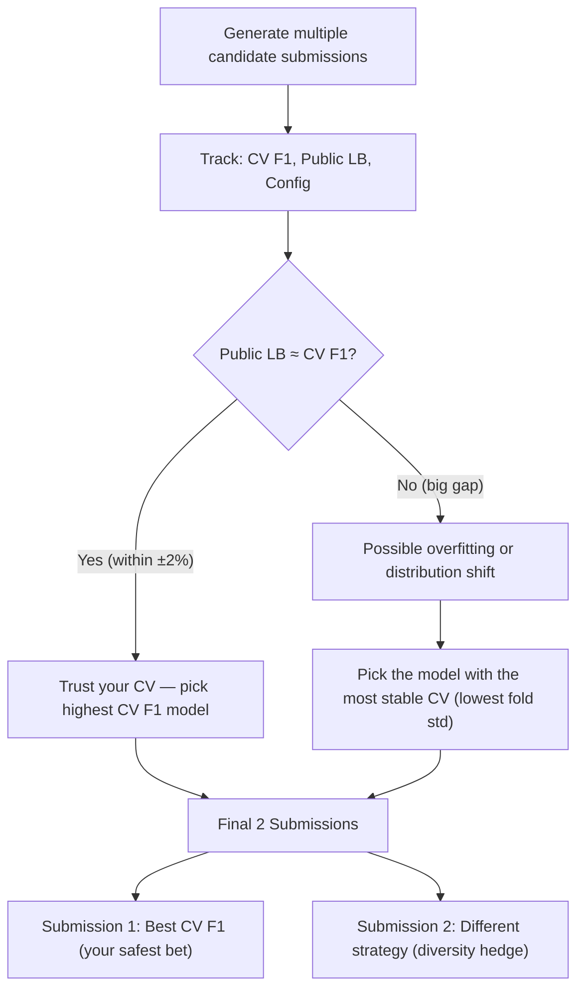

# Phase 11 — Submission Generation & Final Strategy

```
Module: src/submit.py
Priority: CRITICAL — this produces the actual submission
GPU Required: No
Estimated Time: < 1 minute
Dependencies: Phase 9 (final predictions)
```

---

## 11.1 Objective

1. Convert ensemble + TTA probabilities to final class predictions
2. Generate submission CSV in **exact** required format: `filename, appearance`
3. Validate against `sample_submission.csv`
4. Provide a clear decision framework for selecting the **2 final submissions**

---

## 11.2 Functions to Implement

### 11.2.1 `generate_submission(ensemble_probs, test_df, cfg, tag="") -> str`

**Purpose:** Create the submission CSV.

```python
def generate_submission(ensemble_probs, test_df, cfg, tag=""):
    """
    Generate submission CSV from ensemble probabilities.
    
    Args:
        ensemble_probs: (N_test, 4) softmax probabilities
        test_df: Test DataFrame with filenames
        cfg: Config
        tag: Optional tag for the filename (e.g., "ensemble_5fold")
    
    Returns:
        str: Path to the saved submission CSV
    """
    # Argmax to get predicted classes
    predictions = ensemble_probs.argmax(axis=1)
    
    # Create submission DataFrame
    submission = pd.DataFrame({
        'filename': test_df['filename'].values,
        'appearance': predictions.astype(int)
    })
    
    # Validate
    assert len(submission) == len(test_df), \
        f"Submission length {len(submission)} != test length {len(test_df)}"
    assert set(submission.columns) == {'filename', 'appearance'}, \
        f"Wrong columns: {submission.columns.tolist()}"
    assert submission['appearance'].isin([0, 1, 2, 3]).all(), \
        f"Invalid class values detected"
    assert submission['filename'].is_unique, \
        "Duplicate filenames in submission"
    
    # Save
    timestamp = datetime.now().strftime("%Y%m%d_%H%M%S")
    filename = f"submission_{tag}_{timestamp}.csv" if tag else f"submission_{timestamp}.csv"
    save_path = os.path.join(cfg.paths.output_dir, "submissions", filename)
    os.makedirs(os.path.dirname(save_path), exist_ok=True)
    submission.to_csv(save_path, index=False)
    
    print(f"\nSubmission saved: {save_path}")
    print(f"Shape: {submission.shape}")
    
    return save_path
```

---

### 11.2.2 `validate_submission(submission_path, sample_submission_path) -> bool`

**Purpose:** Validate format against the sample submission.

```python
def validate_submission(submission_path, sample_submission_path):
    """
    Validate submission against the sample submission format.
    """
    sub = pd.read_csv(submission_path)
    sample = pd.read_csv(sample_submission_path)
    
    errors = []
    
    # 1. Column check
    if list(sub.columns) != list(sample.columns):
        errors.append(f"Columns mismatch: {sub.columns.tolist()} vs {sample.columns.tolist()}")
    
    # 2. Row count check
    if len(sub) != len(sample):
        errors.append(f"Row count mismatch: {len(sub)} vs {len(sample)}")
    
    # 3. Filename check — same set of filenames
    sub_files = set(sub['filename'])
    sample_files = set(sample['filename'])
    if sub_files != sample_files:
        missing = sample_files - sub_files
        extra = sub_files - sample_files
        if missing:
            errors.append(f"Missing {len(missing)} filenames: {list(missing)[:5]}...")
        if extra:
            errors.append(f"Extra {len(extra)} filenames: {list(extra)[:5]}...")
    
    # 4. Value range check
    valid_values = {0, 1, 2, 3}
    actual_values = set(sub['appearance'].unique())
    if not actual_values.issubset(valid_values):
        errors.append(f"Invalid appearance values: {actual_values - valid_values}")
    
    # 5. No nulls
    if sub.isnull().any().any():
        errors.append("Submission contains null values")
    
    # 6. Filename ordering check
    if not (sub['filename'].values == sample['filename'].values).all():
        print("  ⚠ Filenames are in different order (usually OK for Kaggle)")
    
    if errors:
        print("\n✗ VALIDATION FAILED:")
        for e in errors:
            print(f"  - {e}")
        return False
    
    print("\n✓ Submission validation PASSED")
    print(f"  Rows: {len(sub)}")
    print(f"  Columns: {list(sub.columns)}")
    print(f"  Value distribution: {sub['appearance'].value_counts().sort_index().to_dict()}")
    
    return True
```

---

### 11.2.3 `print_submission_summary(submission_path, cv_results, cfg)`

**Purpose:** Print a comprehensive summary to guide submission selection.

```python
def print_submission_summary(submission_path, cv_results, cfg):
    """
    Print final summary to help pick the 2 best submissions.
    """
    sub = pd.read_csv(submission_path)
    
    print(f"\n{'='*70}")
    print("SUBMISSION SUMMARY")
    print(f"{'='*70}")
    
    print(f"\nFile: {submission_path}")
    print(f"Backbone(s): {cfg.crossval.backbones}")
    print(f"Folds: {cfg.crossval.n_folds}")
    print(f"TTA: {'Enabled' if cfg.tta.enabled else 'Disabled'}")
    print(f"Pseudo-labeling: {'Enabled' if cfg.pseudo.enabled else 'Disabled'}")
    
    print(f"\nLocal CV Macro F1: {cv_results.get('cv_macro_f1', 'N/A'):.4f}")
    if 'cv_per_class_f1' in cv_results:
        print("Per-class CV F1:")
        for cls, f1 in cv_results['cv_per_class_f1'].items():
            print(f"  {cls}: {f1:.4f}")
    
    print(f"\nPredicted test distribution:")
    dist = sub['appearance'].value_counts().sort_index()
    for cls, count in dist.items():
        pct = count / len(sub) * 100
        print(f"  Class {cls} ({cfg.class_names[cls]}): {count} ({pct:.1f}%)")
    
    print(f"\n{'='*70}")
```

---

## 11.3 Final Submission Selection Strategy

> [!IMPORTANT]
> **You get only 2 final submissions.** Choose wisely.

### Decision Framework



### Recommended 2 Final Submissions

| Slot | Submission | Rationale |
|------|-----------|-----------|
| **#1 (Safe)** | Multi-backbone ensemble (EfficientNetV2-S + ConvNeXt + Swin) with TTA, NO pseudo-labeling | Most robust: architecture diversity + TTA reduces variance |
| **#2 (Hedge)** | Best single-backbone 5-fold ensemble with pseudo-labeling (if it improved CV) | Different strategy for diversification. OR: if pseudo-labeling didn't help, use single best backbone without TTA |

### Tracking Spreadsheet

Maintain a log of all submissions:

```
| # | Timestamp | Config | Backbone(s) | Folds | TTA | Pseudo | CV F1 | Public LB | Notes |
|---|-----------|--------|-------------|-------|-----|--------|-------|-----------|-------|
| 1 | 08/16 12:00 | v1 | effnetv2s | 5 | ✗ | ✗ | 0.72 | 0.71 | Baseline |
| 2 | 08/16 14:00 | v2 | effnetv2s | 5 | ✓ | ✗ | 0.74 | 0.73 | +TTA |
| 3 | 08/16 18:00 | v3 | 3-backbone | 5 | ✓ | ✗ | 0.78 | ? | Ensemble |
| 4 | 08/16 22:00 | v4 | 3-backbone | 5 | ✓ | ✓ | 0.79 | ? | +Pseudo |
```

---

## 11.4 Submission Checklist

Before submitting to Kaggle:

- [ ] **CSV format validated** against `sample_submission.csv`
- [ ] **All test filenames present** (2,798 rows)
- [ ] **No null values**
- [ ] **Values are integers** (0, 1, 2, 3)
- [ ] **Column names exact:** `filename, appearance`
- [ ] **Predicted distribution sanity check:** not all one class
- [ ] **CV F1 recorded** for tracking
- [ ] **Config saved** alongside submission for reproducibility

---

## 11.5 Post-Submission Analysis

After each Kaggle submission, compare Public LB score to local CV:

| Scenario | Interpretation | Action |
|----------|---------------|--------|
| Public LB ≈ CV (±1%) | Good calibration | Trust your CV going forward |
| Public LB < CV by 3%+ | Overfitting to train/val | Increase regularization, more augmentation |
| Public LB > CV by 3%+ | Underfitting or lucky public split | Don't over-index on this |

---

## 11.6 Configuration

```yaml
submission:
  output_name: "submission.csv"
  validate_against_sample: true
```

---

## 11.7 Complete Pipeline Command

```bash
# Step 1: EDA
python -m src.eda

# Step 2–3: Data prep + noise detection (manual review after)
python -m src.noise

# Step 4–8: Cross-validation training
python -m src.crossval

# Step 9–11: Inference + submission
python -m src.infer
python -m src.submit

# Optional Step 10: Pseudo-labeling (if base CV F1 ≥ 0.70)
python -m src.pseudo
python -m src.infer --use-pseudo
python -m src.submit --tag pseudo
```
